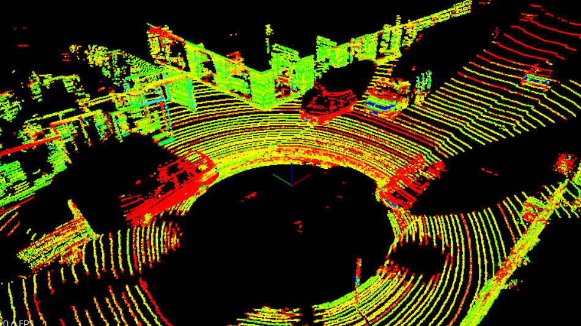
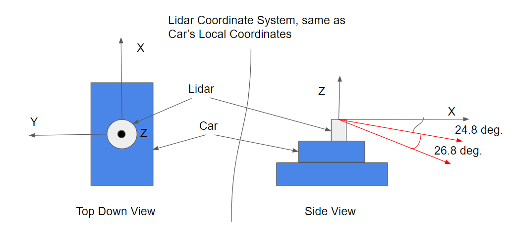
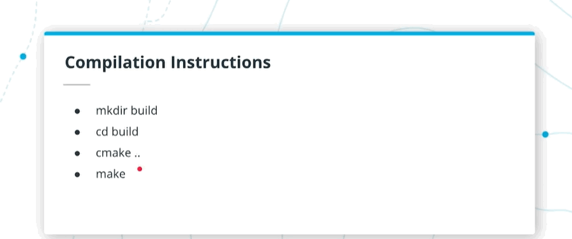
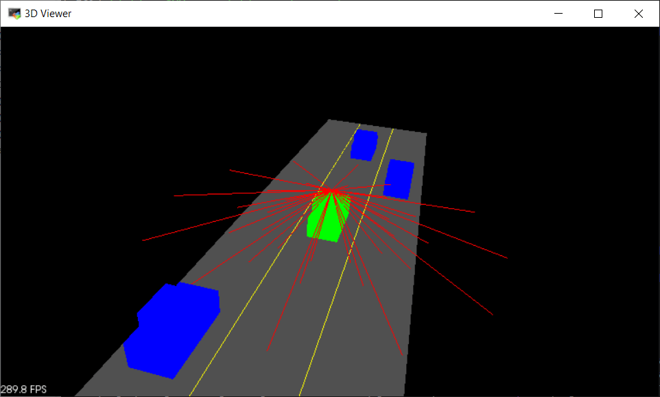

# 1. Welcome

在本课程中，我们将讨论传感器融合，这是一个从多个传感器获取数据并将其结合起来的过程，以便更好地了解我们周围的世界。我们将主要关注两个传感器，激光雷达和雷达。到最后，您将融合来自这两个传感器的数据来跟踪道路上的多辆车，估计它们的**位置和速度**。  

在传感器融合中，通过将激光雷达的高分辨率成像与雷达测量物体**速度**的能力相结合，我们可以比单独使用其中一个传感器更好地了解周围环境。不过，在开始将多个传感器信息融合在一起之前，您将首先贯通**从原始激光雷达数据中获取障碍物位置的过程**。开始前，我们来看看激光雷达传感器和它们产生的高分辨率点云。

# 2. MBRDNA Introduction

在整个激光雷达课程中，你将从迈克尔·迈勒的角度来看待激光雷达。Michael管理着MBRDNA的传感器融合团队。在下一个视频中，Michael会告诉你一些关于他自己和他在MBRDNA的角色。

我是迈克尔·梅勒，我在MBRDNA工作，我是传感器融合团队的经理。MBRDNA代表北美梅赛德斯-奔驰研发中心，是美国梅赛德斯-奔驰研发中心。我管理传感器融合和定位团队，我们的职责是对自动驾驶汽车所处的驾驶环境进行连贯准确的描述。我主要是让团队中的人开心。这听起来很愚蠢，但这是最主要的事情，保持团队的团结，保持他们的积极性，让每个人都朝着同一个方向跑，这是我的基本职能。

# 3. What is Lidar?

### What is Lidar?
激光雷达是一种传感器。激光雷达代表**光探测和测距**。类似雷达。它发出光束，并测量光束返回所需的时间。所以它决定了到一个物体的距离。

### What's the difference between lidar and laser?
激光雷达包含一个激光器。激光雷达只是一种基本上由激光组成的装置，一种偏转方法，主要是扫描穿过视场的激光束，以及光电二极管或光电探测器，检测从物体反射的入射光子。

### How does lidar work?
因此，激光会发出一个非常短的脉冲，几纳秒，然后测量脉冲到达目标然后返回到激光雷达那里所需的时间。这个时间给我们一个指示，或者给我们**到那个物体的确切距离**。你扫描这束激光穿过视场，这意味着你**得到视场中的每一个点，到一个物体的距离**，或者如果没有物体，就没有距离。从这里，它可以准确地告诉你物体的位置，以及它们的距离。

### What type of work have you done with lidar?
我们在整个传感器套件中使用激光雷达作为一个传感器。我们有几种不同类型的传感器。我们有**激光雷达，雷达，还有各种各样的照相机和超声波**。所有这些传感器一起工作来检测和跟踪环境中的物体。
 
# 4. Lidar Sensors

## What types of lidar are available for autonomous vehicles?
有几种不同的类型，最常见的或最著名的是由Velodyne首创的，这是旋转激光雷达。你有一个连杆，连杆上有一束激光，它可以连续旋转360度，发出脉冲，这样你就能得到360度的环境图片，以及几个不同的层。激光雷达的旋转频率约为10赫兹，这是最常见的一个。另外还有激光雷达使用小的微反射镜或大的反射镜扫描激光束穿过一个激光束，然后穿过视场。你有使用相控阵类型原理的固态激光雷达，像相控阵雷达，光束之间的相位差被用来控制光束，基本上控制光束。你有使用色散关系和棱镜的激光雷达，还有其他一些更奇特的电光方法。

## How much power does a lidar unit consume?
激光雷达的能量消耗取决于一些因素。我的意思是整个系统，像目前的Velodyne 32POC总共使用10瓦。旧的Velodyne，这个巨大的装置在汽车顶部与旧的64束使用约60瓦。但更有趣的是激光的输出功率，因为这取决于波长，这与眼睛的安全性有关。所以，如果你有一个905纳米范围的激光，那就是较短的波长范围，大约需要2毫瓦。如果你使用的是一种激光，也就是说，在1500纳米的范围内，它可以使用，我认为它的功率是其他激光的10倍，这意味着它实际上可以达到比短波长激光更远的距离，并且和其他激光一样安全，但是它也有更昂贵的组件。如果你能在不伤害眼睛的情况下观察激光雷达光束，基本上激光雷达光束是安全的。有不同的波长有不同的功率水平，这是眼睛安全。有不同种类的激光，通常用于汽车激光雷达的是一类，这是眼睛安全的。

## Lidar
激光雷达传感通过发送数千个激光信号给我们提供高分辨率的数据。这些激光从物体上反射回来，返回到传感器，然后我们可以**通过信号返回所需的时间来确定物体的距离**。此外，我们还可以通**过测量返回信号的强度来了解被扫到的物体**。每一束激光都在红外光谱中，以许多**不同的角度发出**，通常在360度范围内。虽然激光雷达传感器为我们周围的世界提供了非常高精度的3D模型，但它们目前非常昂贵，一个标准单元的价格超过60000美元。
- 激光雷达以不同的角度发射数千束激光。
- 激光被发射，反射障碍物，然后用接收器检测。
- 根据发射和接收激光的时间差，**计算出距离**。
- 还接收到激光强度值，可用于评价激光反射物体的**材料性能**。

## Lidar Sensors


> Velodyne激光雷达传感器，从左到右配有HDL 64、HDL 32、VLP 16。传感器越大，分辨率越高。

## Lidar Schematic


> VLP 64原理图，显示激光雷达发射器、接收器和外壳。

这是HDL64激光雷达的规格。激光雷达有64层，每层从Z轴以不同的角度发出，所以倾斜角度不同。每层覆盖360度视图，角度分辨率为`0.08`度。激光雷达平均每秒扫描十次。激光雷达可辨认出超过120米的汽车和树叶，并能感知超过50米的远人行道。

## VLP Sensor Specifications


## How many Lidar Points?

给定这些规格，HDL 64每秒大约收集多少点？ 假设平均更新率为10Hz。


# 5. What is a Point Cloud?

### What is a Point Cloud?
什么是点云？点云是所有被测量的激光雷达反射的集合。所以每一个激光雷达，每一个点都是一个激光束，指向被反射的物体，这就产生了一个点，因为激光束的直径相对较紧。然后你从环境中收集这些激光束的所有反射，这就产生了这个点云。

### How much data does a lidar unit generate?
激光雷达产生的数据取决于激光雷达视场的原理，你知道光束有多密集。但让我们粗略地称之为每秒100兆字节，可能多也可能少。如果你有64线激光，很明显这东西产生的数据要比你只有两层，或者10层或30层的数据多得多。所以它有点依赖激光雷达本身。

# 6. Point Clouds


那么现在我们要如何处理这些点呢？现在，我们来谈谈点云数据。这将是我们点的格式。这是一个.pcd文件。然后我们看上一张幻灯片，我们说好的，每次更新256000个点。好，这些点中的每一个都将以这种格式表示，我们有这个x，y，z笛卡尔坐标，我们也有这个I值。所以我们也有激光的信号强度，这告诉我们一些关于这种材料的反射特性。这就是这个I，所以我们有这个X，Y，Z，I，对于bop 64的一个更新，我们有256000个。这实际上就是这个PCD的样子。


这里，我们看到**不同的强度值是不同的颜色**。所以这里的颜色映射告诉我们物体的反射特性，然后x，y，z特别告诉我们这个点在哪里。然后在这个运行PCD的视频中，我们可以看到这个骑自行车的人在车前，我们在追他。

## Point Cloud Data

让我们深入研究激光雷达数据是如何存储的。LiDAR数据以称为点云数据（简称PCD）的格式存储。pcd文件是（x，y，z）笛卡尔坐标和强度值的列表，它只是环境的一个快照，所以在一次扫描之后。这意味着对于VLP 64激光雷达，PCD文件的值大约为256,000（x，y，z，i）个值。



> 一个有停放车辆的城市街区和一辆经过的面包车的PCD。强度值显示为不同的颜色。大黑点是装有激光雷达传感器的汽车所在的位置。

## PCD Coordinates

我们在讨论这个x，y，z笛卡尔坐标。那它到底是什么样子的呢？这个坐标系是什么？它指的是什么？这个坐标系实际上和汽车的本地坐标相同。这里，我们有一个**自上而下的视图**（左边）。X轴的定义是指向汽车前部，而Y轴指向左侧，而Z轴则指向垂直向上的直线。然后我们有侧视图（右边）。我们可以看到x轴指向外面，z轴垂直指向外面，然后，这会给我们一些关于这些不同的垂直层是如何组织的很好的细节。所以对于这种情况，我们有顶层，它从x轴开始有一个**负24.8度的倾斜**，然后它覆盖了**26.8度的范围**，然后这64层中的每一层都将**均匀地分布在26.8度的范围内**。这就是我们定义x，y，z点坐标系的方法。


## PCD Coordinate System

**点云数据的坐标系与汽车的本地坐标系相同**。在这个坐标系中，X轴指向汽车的前部，Y轴指向汽车的左侧。由于这个坐标系是右手的，所以Z轴指向汽车上方。



> PCD坐标系

## Point coordinates Quiz


# 7. Point Cloud Tools

### What tools does Mercedes-Benz use to work with point clouds?
工程师使用的工具显然取决于工程师。有些工具是每个公司或组织的专有工具，这些工具是随着时间的推移而开发的。我们最初是用立体摄像机工作的。还有一个非常有名的库，叫做**点云库**，它处理的主要事情是分割，以及地平面的分离，等等。在这些工具中，您对点云进行分割，以从点云的所有对象中获取图像，进行聚类分割，等等。还有一个OpenCV，都是使用点云的工具。

# 8. The PCL Library
## The PCL Library

我们现在就去看看PCL库。这是一个点云库。在处理PCD文件时，它将真正帮助我们。原因是，它是一个开源的C++库，在机器人社区中得到了广泛的应用。它将有许多内置的功能，我们可以检查这些功能，以进行过滤、分割和聚类，而真正好的是它还具有这种非常酷的渲染功能。所以我们可以从视觉上看点云，我们可以做这个非常酷的渲染，在不同的框、形状和线条供预览，并真正发挥周围的视觉效果。所以PCL对所有这些都很好。这就是我们在本课中主要要讨论的内容。


在本模块中，您将致力于处理点云数据以发现障碍物。所有的代码都将在C++环境中完成，所以对C++的一些熟悉无疑是有帮助的。PCL是一个开源的C++库，用于处理点云。您将使用它来可视化数据、渲染形状，并熟悉它的一些内置处理功能。有关PCL的一些文档可以在[这里](http://pointclouds.org/)找到。

PCL在机器人社区中广泛用于处理点云数据，有许多在线教程可供使用。PCL中有许多内置功能，可以帮助检测障碍物。本模块稍后将使用的内置PCL函数包括分割、提取和聚类。

# 9. Using Lidar on an Autonomous Vehicle

### Where should you mount a lidar on a robot or vehicle?
你可以在车顶上安装一个激光雷达，以获得最远的视野，但是你在车顶上安装一个激光雷达，它将看不到任何更接近底部靠近车辆的东西。因此，为了填补车辆感官的整体视野，您可以在前面、后面或侧面安装激光雷达，这取决于您在整体覆盖感上的差距。我们在顶上有一堆可以最大限度地扩大视野，在前面和后面有一些可以真正覆盖顶部激光雷达看不到的其他区域。
### What is the ralationship between the vertical field of view and the granularity of a lidar unit?
垂直视场和粒度之间的关系，我想，让我们以Velodyne激光雷达为例，你有一个有限或非常离散的层数，如16层，32层，64层，等等。通常，所有这些激光雷达都有相同的垂直视场，表示为度数，大约是30度。如果有30度和16层，则图像中各层之间的间距为2度。现在，大约60米内有两度，你可以在两层之间隐藏一个行人。所以这限制了你实际的分辨率，但也限制了你能看到的距离，因为如果你在一个物体上没有扫描层，那么这个物体对激光雷达是不可见的。因此，在这个垂直的视场中，层越多，粒度就越细，可以看到的对象就越多，从某种意义上说就是激光雷达看到的范围越远。

# 10. The Course Starter Code
## Starter Repo Structure

所以，我们现在继续研究我们将要使用的启动代码。基本上，我们在前几节课中设置的，是在这个模拟的公路环境中工作，我们将在这里进行激光雷达扫描，并看到我们周围的其他汽车。然后，看看点云处理技术，找出其他汽车在哪里。我们要处理的主要文件有四个：environment.cpp，processpointclouds，还有一个.cpp和一个头文件。然后，有这个render目录。您将不会了解的太深入，只需要知道它在那里，并且它有render.cpp和render.h文件。另外，这是sensor/lidar.h，我们稍后会用它做一些扫描。


## The Starter Code Structure

用于进行激光雷达障碍检测的所有代码都包含在Github仓库中。教室的工作环境已经包含了正确开始的所有依赖项。您还可以克隆repo，并使用自述文件在您自己的机器上启动。这是[链接](https://github.com/udacity/SFND_Lidar_Obstacle_Detection)

您将主要处理两个主要文件，分别是 `environment.cpp` 和 `processPointClouds.cpp` 。`environment.cpp`文件包含主函数，并将生成可运行的可执行文件。`processPointClouds.cpp`文件将包含处理PCD的所有函数占位符。

还有一些其他值得一提的文件，比如`sensors/lidar.h`，它模拟Lidar感知并创建点云数据。还有`render.cpp`和`render.h`，它们具有将对象呈现到屏幕上的功能。

## Code Structure
- Top-level CMakeLists.txt
- Readme
- src
  - render
    - box.h - this file has the struct definitions for box objects
    - render.h
    - render.cpp - this file, along with the header, define the classes and methods for rendering objects.
  - sensors
    - data - this directory contains pcd data used in the course.
    - lidar.h - has functions using ray casting for creating pcd.
  - environment.cpp - the main file for using pcl viewer and processing and visualizing pcd.
  - processPointClouds.h
  - processPointClouds.cpp - Functions for filtering, segmenting, clustering, boxing, loading, and saving pcd.

## Starter Repo Walkthrough

现在让我们继续，在教室里，我们有了这个，我们的工作环境。好的是，我们可以继续，这里有这个桌面按钮。我们可以直接启动到这个虚拟桌面环境中，这里有一个Visual Studio代码。这是提供的ID。我们可以打开它。让我们来看看这里的工作区是什么样子的。所以这里有一个名为source的目录，在source中，我们将得到刚才提到的environment.cpp文件。让我们继续，从概述中查看这个文件，看看它在做什么。好吧，这个文件将是你的主文件，它将在这里有你的主要功能，基本上，这将要做的是启动这个可视窗口，你可以用来查看在你的场景你的点云和其他物体。那么这些是什么其他物体呢？好吧，这里我们要创造一个简单的公路环境。所以有一条高速公路，它将生成这些虚拟汽车，这条虚拟街道，它将把这些都呈现给观众。还有这个函数用于执行initcamera，这个initcamera将被设置。所以当你第一次启动窗口的时候，你可以看到这些不同的摄像机视图。所以，您将在这个environment.cpp中启动这种主要函数。这是另一个大文件。这是processpointclouds.cpp，在这里它有所有这些函数装饰设置，用于进行过滤和分割。所以，如果我们看这个，如果我们到了顶部，我们可以看到它被定义为这个类，它使用了一些不同的模板，稍后我们将讨论这些模板。所以我们实际上可以创建一个点云处理器，然后我们在这里有这些功能来过滤云。我正在做分割。所以我们可以向下滚动。我们有一个聚类函数。然后我们要讨论一点渲染，这就是我们要渲染模拟环境的方法。最后一件事，我们很快就会处理这个文件。是一个激光雷达对象，它将实际进行光线投射，我们将使用它来创建一些点云数据。


# 11. Compiling the Lidar Simulator
## Compilation Instructions


## Compilation Walkthrough



# 12. Running the Simulator

我们研究并编译了我们的可执行文件，现在我们实际上要研究运行环境。这就是它的输出应该是什么样子的，在这里我们有绿色的ego car，我们有蓝色的其他交通车，它都很好地坐落在这个虚拟的公路上。


所以现在就要执行这个模拟环境。一旦您真正编译了这个可执行文件，实际上只是为了运行它，您所要做的就是运行build目录的./environment。然后，我们就可以环视周围的环境，我们可以使用鼠标来缩放、环绕和查看我们的场景。所以，让我们继续，检查一下build内部，如果我们只是运行./environment。我们现在有了这个高速公路环境，可以用我们的绿色汽车来看看，所以现在就自己试试吧。启动environment，继续探索它是什么样子。


## Instructions
一旦构建了一个可执行文件，就可以通过执行./environment启动它。现在您应该看到一个窗口弹出，看起来像上面的图像。

这里有一个简单的公路模拟器环境，中心车道上的“ego”车是绿色的（那是你的车），其他的交通车是蓝色的。所有的东西都是用PCL所带的简单的方框、线条和颜色渲染的。您可以用鼠标在环境中移动。试着按住鼠标左键绕着场景旋转。您还可以通过按住鼠标中键并移动来在场景周围平移。要进行缩放，请在移动时使用鼠标中键或鼠标右键。
## Recap
- 使用虚拟桌面中的Terminator，使用./environment从构建目录运行可执行文件。
- 你应该能看到一个3D弹出窗口，里面有道路和汽车。
- 您可以在环境中移动。
- 缩放：按住鼠标右键，向前/向后移动鼠标，或者使用鼠标滚动条。
- 平移：按住鼠标中键（滚动条）并移动鼠标。
- 旋转：按住鼠标左键并移动鼠标。

# 13. The PCL Viewer
## PCL Viewer Overview
在`environment.cpp`创建PCL Viewer。Viewer用于处理屏幕上所有对象的可视化。在`environment.cpp`中使用PCL Viewer的一些函数是`initCamera`和`initHighway`。`initCamera`函数帮助您在窗口中设置不同的视角。有五种不同的选项：XY、TopDown、Side和FPS。XY提供了45度的视角，而FPS是第一人称的感觉，给人一种坐在汽车驾驶座上的感觉。

此外，`render`中的函数也大量使用`viewer`。您可能会注意到，`viewer`通常作为引用传入。这样，流程就更加简化了，因为有些东西不需要返回。

## Walkthrough of PCL Viewer Code

现在我们实际上可以启动这个可执行文件，看看模拟环境是什么样子的，让我们进一步讨论一下它是如何创建场景的。为此，有一个叫做PCL Viewer的东西。这就是点云库Viewer。这就是处理图形和渲染的方法。


因此，它为汽车呈现不同的盒子，为道路，它创建这些线条，我们还使用`environment.cpp`中的函数初始化相机和初始化高速公路环境。所以，让我们继续来看一下`environment.cpp`中的情况。在这里的主视图中，我们实际上有一个在这里创建的viewer。所以这个viewer是一个PCL可视化，PCL可视化工具，基本上，它将以一定的帧速率运行，我们可以向这个查看器添加一些东西。

```c++

int main (int argc, char** argv)
{
    std::cout << "starting enviroment" << std::endl;

    pcl::visualization::PCLVisualizer::Ptr viewer (new pcl::visualization::PCLVisualizer ("3D Viewer"));
    CameraAngle setAngle = XY;
    initCamera(setAngle, viewer);
    simpleHighway(viewer);

    while (!viewer->wasStopped ())
    {
        viewer->spinOnce ();
    }
}
   
```

所以，如果我们在简单的高速公路上观察`initCamera`，我们实际上是在把`viewer`传递给这些函数。让我们看看他们是怎么被传进来的。例如，在照相机中，我们看到这个PCL可视化viewer实际上是作为引用传入的。所以这意味着对它所做的任何更改都将在这个函数之外保持。在这里我们设置背景色，我们可以初始化摄像机参数，我们可以告诉viewer设置这个摄像机位置，这样当我们启动那个窗口时，初始位置就会被设置。

```c++
//setAngle: SWITCH CAMERA ANGLE {XY, TopDown, Side, FPS}
void initCamera(CameraAngle setAngle, pcl::visualization::PCLVisualizer::Ptr& viewer)
{
    viewer->setBackgroundColor (0, 0, 0);

    // set camera position and angle
    viewer->initCameraParameters();
    // distance away in meters
    int distance = 16;

    switch(setAngle)
    {
        case XY : viewer->setCameraPosition(-distance, -distance, distance, 1, 1, 0); break;
        case TopDown : viewer->setCameraPosition(0, 0, distance, 1, 0, 1); break;
        case Side : viewer->setCameraPosition(0, -distance, 0, 0, 0, 1); break;
        case FPS : viewer->setCameraPosition(-10, 0, 0, 0, 0, 1);
    }

    if(setAngle!=FPS)
        viewer->addCoordinateSystem (1.0);
}
```

因此，类似地，`initHighway`函数也在使用该viewer，并在这里再次作为引用传入。我们要做的基本上就是重新设计这些不同的汽车，并指定它们在模拟环境中的位置。我们正在创建一个这些汽车的向量，对于这个观察者，我们基本上称之为把viewer作为一个引用再次传入car，这告诉viewer，我要把这辆车渲染到场景中。我要把这条高速公路呈现给viewer看。这就是PCL Viewer的工作原理。它为我们处理所有的图形。

```c++
std::vector<Car> initHighway(bool renderScene, pcl::visualization::PCLVisualizer::Ptr& viewer)
{

    Car egoCar( Vect3(0,0,0), Vect3(4,2,2), Color(0,1,0), "egoCar");
    Car car1( Vect3(15,0,0), Vect3(4,2,2), Color(0,0,1), "car1");
    Car car2( Vect3(8,-4,0), Vect3(4,2,2), Color(0,0,1), "car2");
    Car car3( Vect3(-12,4,0), Vect3(4,2,2), Color(0,0,1), "car3");

    std::vector<Car> cars;
    cars.push_back(egoCar);
    cars.push_back(car1);
    cars.push_back(car2);
    cars.push_back(car3);

    if(renderScene)
    {
        renderHighway(viewer);
        egoCar.render(viewer);
        car1.render(viewer);
        car2.render(viewer);
        car3.render(viewer);
    }

    return cars;
}
```

# 14. Representing Lidar in a Simulator

### How do you represent a lidar unit in a simulator?
目前，我们还没有在模拟器中使用直接表示，但我们正在研究激光雷达模型。你可以得到激光雷达模型。然后你可以把它表示为模拟器中传感器模型中的那些单独的光束，你可以用激光雷达使用gpu实时跟踪光线。然后得到一个非常精确的点，得到点云，基于你所代表的环境，因为模拟器中的环境也仅仅是反射率的近似不管表面的材料属性是什么。但这是可以做到的，我们正在研究它因为它使模拟更有用因为那样你就不用做那么多假设。

# 15. Creating the Lidar Object

接下来，我们要为我们的模拟环境创建一个激光雷达。我们之前讲过一些关于lidar.h文件的内容。它在传感器目录中。实际上，我们将使用它来创建这个虚拟激光雷达，然后使用它来扫描环境并使用它创建一些PointCloud数据。我们要做的第一件事实际上是想象当它们被投射到这个虚拟激光雷达单元这些激光雷达光线是什么样子的。我想让你们做的是回到工作区环境。我们将研究`simpleHighway`函数。基本上，这里有一个TODO，那就是创建一个Lidar对象。我想让你们做的基本上是在TODO中，它说创建激光雷达传感器，就是创建这个Lidar对象。为了做到这一点，继续在sensor目录中检出lidar.h，看看它是如何定义的。基本上，激光雷达对象是什么，它是一个结构体。它有一些用于保存PointCloud的参数，还有一个构造函数，您将使用它来设置它。在Lidar.h第85行，看看这个。这就是你实际实例化激光雷达，看看它在用什么。这些参数是用来进行光线投射的。它基本上是告诉激光雷达光线可以反射到什么物理物体上。我们仿真环境中的对象是汽车，这个是地面坡度值。这里我们讨论的是非常水平的地面，所以我们用0表示。我们得到的车，实际上来自`initHighway`。它将为我们产出这些汽车并返回。你可以在`environment.cpp`中实例化这个激光雷达对象。让我们在堆上实例化它。因此，为了在堆上实例化，需要使用new关键字。我们在堆上而不是栈上做这个的原因是这个激光雷达实际上会保存这个点云也许它可能会非常大。在栈上，我们只有大约2兆字节可用。在堆上，它们可以更大。让我们用new关键字实例化堆上的Lidar对象。它将是这个Lidar指针然后是new Lidar。这里我将使用这个声明来设置参数，这些参数是从`initHighway`返回的汽车，然后为地面设置为零。切出这个lidar .h文件，然后回到`environment.cpp`，然后看看是否可以在`simpleHightway`函数的TODO中创建这个激光雷达对象。
```c++
void simpleHighway(pcl::visualization::PCLVisualizer::Ptr& viewer)
{
    // ----------------------------------------------------
    // -----Open 3D viewer and display simple highway -----
    // ----------------------------------------------------
    
    // RENDER OPTIONS
    bool renderScene = true;
    std::vector<Car> cars = initHighway(renderScene, viewer);
    
    // TODO:: Create lidar sensor 

    // TODO:: Create point processor
  
}
```
## Adding Lidar

你要做的第一件事是创建一个激光雷达对象。lidar对象由包含在`environment.cpp`顶部的`src/sensor/lidar.h`头文件定义。在`environment.cpp`中的`simpleHighway`函数，它接受前面讨论过的PCL visualizer `viewer`的引用参数。

## Exercise Instructions
您将在`simpleHighway`函数中实例化指向`Lidar`对象的指针。您应该使用`new`关键字在堆上创建`Lidar`指针对象。`Lidar`的构造函数有两个参数:`cars`和`slope of the ground`——这些参数对于光线碰撞建模是必要的。`Lidar`对象的斜率应该为0。

### Note
激光雷达参数是建模射线碰撞的必要参数。激光雷达对象将是保存点云数据，这可能是非常大的。通过在堆上声明，我们可以使用的内存比栈上的2MB还要多。但是，在堆上查找对象需要更长的时间，而栈查找非常快。

### Solution

```diff
diff --git a/src/environment.cpp b/src/environment.cpp
index 2141446..ed7974a 100644
--- a/src/environment.cpp
+++ b/src/environment.cpp
@@ -46,9 +46,9 @@ void simpleHighway(pcl::visualization::PCLVisualizer::Ptr& viewer)
     std::vector<Car> cars = initHighway(renderScene, viewer);

     // TODO:: Create lidar sensor
-
+    Lidar *pLidar = new Lidar(cars, 0.0);
     // TODO:: Create point processor
-  
+
```

# 16. Using the Lidar Object
## Video
接下来，让我们看看如何使用这个激光雷达对象来扫描我们周围的环境，并告诉我们环境是什么样的。所以在下一个练习中，我们要做的是激光雷达传感，我们要从Lidar.h中调用“Scan”函数。然后我们看一下扫描结果，我们会看到创建的射线。


激光雷达激光实际上是由激光雷达传感器产生的。为了做到这一点，看看`lidar.h`，底部附近有一个“Scan”函数。所以`Scan`实际上不接受任何参数。激光雷达有它需要知道的一切。它有汽车和地面坡度。它会为我们生成这个PCL点云。所以当您调用“Scan”时，只需确保对生成的变量使用相同的类型。然后你就可以把它可视化了。这个点云是通过`render.cpp`中的一个函数生成的。它有一个叫做`renderRays`的函数在`render.cpp`的第24行。您可以调用“renderRays”并检查它的参数。我们有这个`veiwer`，我们把它作为引用传递。我们将使用`environment.cpp`中的`viewer`提供给“renderRay”。我们也会告诉它关于这个激光雷达的`origin`。这是因为所有光线都是从这个原点射出的。为了对光线进行可视化，我们需要知道这个位置。最后一个参数就是我们从`scan`中生成的点云。如果你把它传递进去，你就能想象它是什么样的。回到`environment.cpp`中，看看`lidar.h`中的文档，了解如何使用“Scan”，生成点云，然后在“renderRays”函数中生成点云。继续编译并运行，结果应该是这样的。


## Notes
要进一步使用新创建的`Lidar`对象，请查看`src/sensor/Lidar.h`，以了解如何定义所有内容。在这个头文件中，您可以看到正在定义`ray`对象。激光雷达将使用这些光线通过光线投射来感知周围环境。`Lidar Struct`的`scan`函数将进行光线投射。

现在让我们调用激光雷达`scan`函数，看看激光雷达光线是什么样子的。回到`environment `文件中，在调用`Lidar`构造函数之后，您可以使用`scan`函数，然后渲染Lidar射线。


Lidar Sensing

## Exercise
- 要创建点云，请在您的激光雷达对象上调用激光雷达`scan()`方法。
- 您将在`PointCloud`指针对象中存储结果，`pcl::PointCloud<pcl::PointXYZ>::Ptr`
- `PointCloud`的点类型将是`pcl::PointXYZ`。
- 使用生成的点云指针调用`renderRays`函数。

## 注意
使用模板的`PointCloud`语法类似于`vector`或其他`std`容器库的语法:`ContainerName<ObjectName>`。

`PointCloud`中的`Ptr`类型表示该对象实际上是一个指针——一个包含`point cloud`对象的内存地址的32位整数。`pcl`中的许多函数都使用点云指针作为参数，因此以这种形式返回`inputCloud`很方便。

`renderRays`函数在`src/render`中定义。它包含的函数允许我们向`pcl`查看器呈现点和形状。您将使用它在查看器中来渲染您的激光雷达射线作为线段。

`renderRays`函数的参数是`viewer`，它通过引用传入。这意味着`renderRays`函数体中`viewer`的任何更改都会直接影响到函数作用域之外的`viewer`。激光雷达的位置也被传递进来，以及你的`scan`函数生成的点云。`PointCloud`的点类型将是`pcl::PointXYZ`。我们稍后会讨论其他不同类型的点云。

## Solution

```diff
diff --git a/src/environment.cpp b/src/environment.cpp
index ed7974a..5022357 100644
--- a/src/environment.cpp
+++ b/src/environment.cpp
@@ -48,7 +48,8 @@ void simpleHighway(pcl::visualization::PCLVisualizer::Ptr& viewer)
     // TODO:: Create lidar sensor
     Lidar *pLidar = new Lidar(cars, 0.0);
     // TODO:: Create point processor
-
+    pcl::PointCloud<pcl::PointXYZ>::Ptr cloud = pLidar->scan();
+    renderRays(viewer, pLidar->position, cloud);
 }
```



# 17. Templates and Different Point Cloud Data

现在，让我们继续讨论模板。当我们从“扫描”中创建点云时，这就产生了效果，所以基本上，我们之前说有很多不同类型的点云。在我们的例子中，我们使用的是PCL PointXYZ。所以在这个模板中，它被固定在这里的箭头括号中。就像一个参数说的。"好的，我们使用的是PCL PointCloud，它的类型是PCL PointXYZ。" 将来，您可以使用PointXYZI或PointXYZRGB。但模板就是这样的，它很好，因为它允许我们做可重用的代码。所以在我们的例子中，我们使用这个pointxyz。稍后，我们将看到pointxyzi。


值得注意的一件事是，让我们看看那些模板是如何定义在点处理函数Clouds.cpp的。所以，如果我们看这个文件，我们可以看到很多有模板的地方。所以模板是用这个类型名pointT设置的。基本上，这意味着pointT是可变的，它可以代替这些不同类型的PointClouds。让我们来看一个例子函数，比如，让我们看看FilterCloud。如果我们检查一下，并且在上面设置了模板。让我们看看那个点在哪里被使用。这是在这里作为PCL PointCloud使用的那个点。现在，您可以使用不同类型的点云。但我们会注意到这里有这个类型名。这个测验将激励我们或者帮助我们理解为什么要使用这个类型名。我们在这里为这个云实际使用的是指针类型。那到底是什么意思？好吧，我们来看看这个的定义。所以如果我们回到教室，我们将看到不同点云数据中的模板。我们这里有一些模板的定义。此外，我们现在有了下面这个测试的帮助文档。什么是PCL PointCloud PointT指针？这是一个typedef boost共享指针。所以这个测验是在问。您认为PCL PointCloud PointT指针是什么？它是一个值还是一个类型，文档将帮助您回答这个问题。它是typedef boost共享指针。你觉得是什么？这是一个有点棘手的问题，但接下来我们将讨论它，以及为什么它在我们的案例中很重要，以及它如何与流程点云中的类型名相关。


## Overview of PCD types
### Why Use Templates?
以前使用的LiDAR扫描函数生成了一个`PCL PointCloud`对象，其中包含`PCL::PointXYZ`点。对象使用模板是因为有许多不同类型的点云：一些是三维的，一些是二维的，一些包括颜色和强度。这里您使用的是普通的三维点云，因此使用了`PointXYZ`。但是，在本课程的后面，您还将获得具有强度分量的点。

模板可以自动执行这个过程，而不是定义两个独立的函数，一个是PointXYZ的参数，另一个是PointXYZI的参数。对于模板，您只需编写一次函数，并像使用参数一样使用模板来指定点类型。

### Templates and Pointers
如果您以前没有使用带有指针的模板，您可能在代码中注意到，每当使用依赖于模板的指针时，都会使用typename。例如，在这里的函数签名中：
```c++
typename pcl::PointCloud<PointT>::Ptr ProcessPointClouds<PointT>::FilterCloud(typename pcl::PointCloud<PointT>::Ptr cloud, float filterRes, Eigen::Vector4f minPoint, Eigen::Vector4f maxPoint)
```

原因如下：给定一段带有类型名参数的代码，如`pcl::PointCloud<PointT>::Ptr`，**编译器无法在不知道类型名参数值的情况下确定代码是值还是类型。编译器将假定代码代表一个值。如果代码实际上代表一个类型名，您需要指定它**。

用下面的测验测试你自己的直觉。您可以使用此[文档](http://docs.pointclouds.org/1.8.1/classpcl_1_1_point_cloud.html#a86473dec40d705190c6b2c2f795b9f15)获取帮助。


# 18. Adjusting Lidar Parameters

现在，我们来看看如何调整我们的激光雷达参数，这样我们就能获得更高的激光雷达扫描分辨率。这就是我们的目标。我们需要更多的光线。我们需要大量的这些光线照射到我们的车上，然后就可以利用这些数据来辨别这些车在环境中的位置。所以在下一个练习中，我们将回到`lidar.h`，在这个文件中有几个TODO。这些TODO包括增加层数。所以，如果我们看`Lidar.h`，在结构体Lidar中，我们会看到这些待办事项，可以看到`numLayers`当前是3。我将继续把它增加到8，然后要做的其他事情是，我们想要一个更好的水平层增量分辨率。现在，它做的是$Pi/6$的增量。相反，做$Pi/64$，然后最后两个设置最小距离。那你为什么要这么做？这些激光器中的一些实际上会击中你的车顶，而那些确实不会告诉你太多关于环境的信息，这些信息告诉你，“嘿，你的车顶就在那里吗？”所以继续。我们可以通过说，如果一个点离激光雷达传感器太近，那么我们假设它只是车顶，我们不担心它。因此，您可以将其设置为5，以从车顶上删除点，而不是使用最小距离0。最后一件事是增加噪音。好吧，在现实中的任何情况下，我们都有很多我们正在处理的噪声，事情不完美，事情不干净，所以只是在扫描中添加一些噪声实际上会创建一些更有趣的PCD数据，也可以让您有更强大的算法来处理这些数据。实际上，让我们做一个相当高的噪声。不用零，我们可以做`0.2`，这个单位是米，所以它会很高，但它会给我们一些有趣的PCD数据，稍后再看。所以继续，现在只需要几分钟时间来完成`lidar.h`并更改这些参数，然后继续编译和运行，并查看提高的分辨率。然后，这里使用的参数只是建议。这些可以看到所有的汽车，但也非常鼓励你玩其他参数，你甚至可以看到，如果你能与BOP 64完美匹配，真正测试的局限性是射线投射。你能得到`256000`束激光吗？是的，去看看吧。

## Lidar Parameters
您可以围绕场景进行动态观察和移动，以查看正在投射的不同光线。但是，当前的激光雷达设置将限制您可以执行的操作。分辨率很低，从场景中可以看到，只有一束光线接触到一辆车。所以你的下一个任务是提高激光雷达的分辨率，这样你就能清楚地看到周围的其他汽车。为此，请按照`lidar.h`中TODO语句的说明进行操作。

更改包括**增加最小距离**，这样就不包括与车顶的接触点，**增加水平和垂直角度分辨率**，最后**添加噪音**。由于单位为米，因此要添加的噪声实际上相当高，但它将在场景中生成更有趣和更真实的点数据。也可以完全自由的实验和玩这些激光雷达超参数！

### Exercise
- 现在您将通过增加**垂直层的数量**和**围绕Z轴的角度分辨率**来提高激光雷达的分辨率。
  - `numLayers`应该从3改为8。
  - `horizontalLayerIncrement`应从$Pi/6$改为$Pi/64$。
- 将`MinDistance`设置为5（米），以从车顶上移除点。
- 加上噪音，大约0.2，得到一个更有趣的PCD。

完成练习后，输出应该如下图所示。


> Increasing Lidar Range

## Solution

```diff
diff --git a/src/sensors/lidar.h b/src/sensors/lidar.h
index 022e328..14917e0 100644
--- a/src/sensors/lidar.h
+++ b/src/sensors/lidar.h
@@ -86,21 +86,21 @@ struct Lidar
                : cloud(new pcl::PointCloud<pcl::PointXYZ>()), position(0,0,2.6)
        {
                // TODO:: set minDistance to 5 to remove points from roof of ego car
-               minDistance = 0;
+               minDistance = 5;
                maxDistance = 50;
                resoultion = 0.2;
                // TODO:: set sderr to 0.2 to get more interesting pcd files
-               sderr = 0.0;
+               sderr = 0.2;
                cars = setCars;
                groundSlope = setGroundSlope;

                // TODO:: increase number of layers to 8 to get higher resoultion pcd
-               int numLayers = 3;
+               int numLayers = 8;
                // the steepest vertical angle
                double steepestAngle =  30.0*(-pi/180);
                double angleRange = 26.0*(pi/180);
                // TODO:: set to pi/64 to get higher resoultion pcd
-               double horizontalAngleInc = pi/6;
+               double horizontalAngleInc = pi/64;

                double angleIncrement = angleRange/numLayers;
```


# 19. Examining the Point Cloud


现在您可以看到激光雷达射线的样子了，那么您将要使用和处理的实际点云数据是怎样的呢？可以使用render中的`renderPointCloud`函数查看点云数据。您还可以选择关闭高速公路场景的渲染，以便可以看到点云本身的外观。

上图中的结果是没有噪音，激光雷达`minDistance`设置为零。使用更高激光雷达`minDistance`，你可以删除以上击中车顶的点，因为这些不会帮助你检测其他汽车。此外，一些噪声变化有助于创建更有趣的点云。此外，添加噪声将帮助您开发更强大的点处理功能。

### Exercise
现在，您将自己查看激光雷达的点云，没有射线。
- 为此，请在`simpleHighway`函数中调用`renderPointCloud`，而不是`renderRays`。
- 您还可以在`environment.cpp`中将`renderScene`设置为false，从而无障碍地查看点云。

完成后，输出应如下图所示。


> Simulated PCD

## Solution
```diff
diff --git a/src/environment.cpp b/src/environment.cpp
index e2e5248..149d18d 100644
--- a/src/environment.cpp
+++ b/src/environment.cpp
@@ -42,14 +42,16 @@ void simpleHighway(pcl::visualization::PCLVisualizer::Ptr& viewer)
     // ----------------------------------------------------

     // RENDER OPTIONS
-    bool renderScene = true;
+    bool renderScene = false;
     std::vector<Car> cars = initHighway(renderScene, viewer);

     // TODO:: Create lidar sensor
     Lidar *lidar = new Lidar(cars, 0);

     pcl::PointCloud<pcl::PointXYZ>::Ptr inputCloud = lidar->scan();
-    renderRays(viewer, lidar->position, inputCloud);
+    // renderRays(viewer, lidar->position, inputCloud);
+    renderPointCloud(viewer, inputCloud, "inputCloud");
+
     // TODO:: Create point processor

 }
```


- 多少线激光雷达什么意思？


- 激光雷达水平分辨率


# 20. Outro
太棒了。您已经创建了一个激光雷达传感器，您正在看到并产生高分辨率点云数据。您生成的数据足以检测周围的车辆。接下来，您将创建一个point processor对象来检测点云的哪些部分表示交通中的车辆。看看下一课，点云分割。

