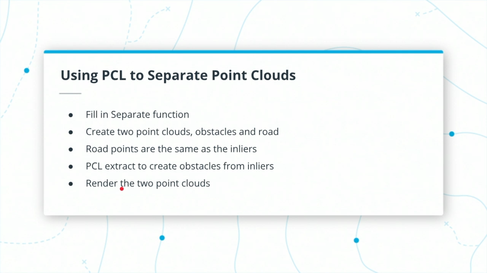
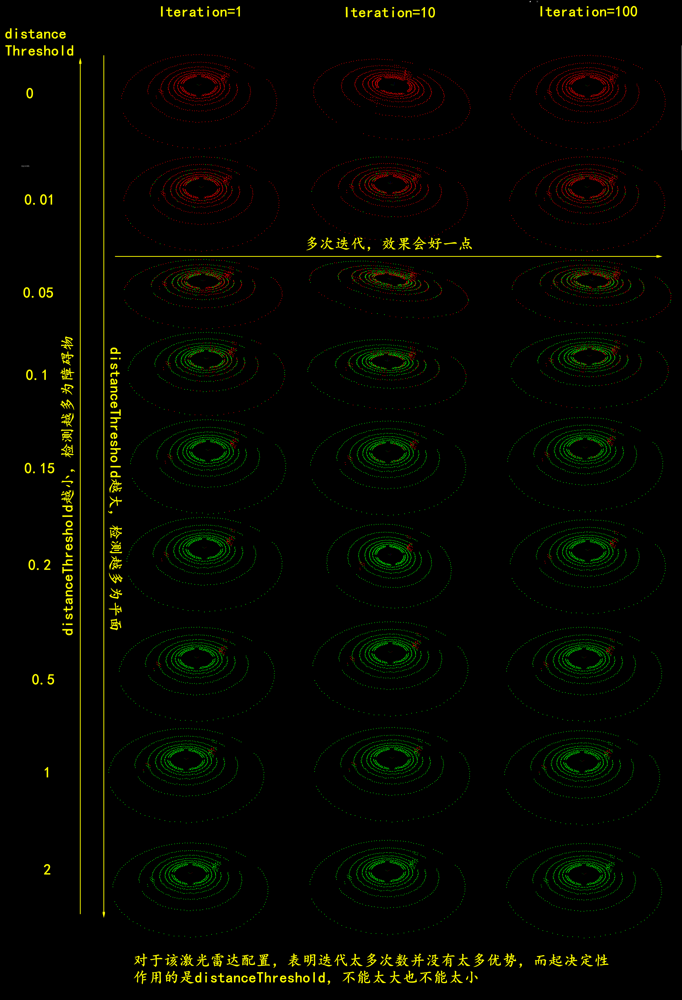
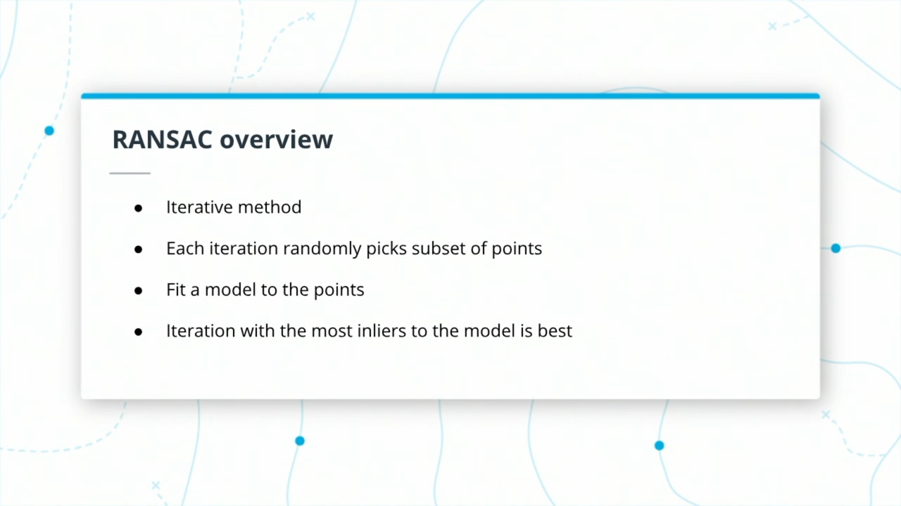
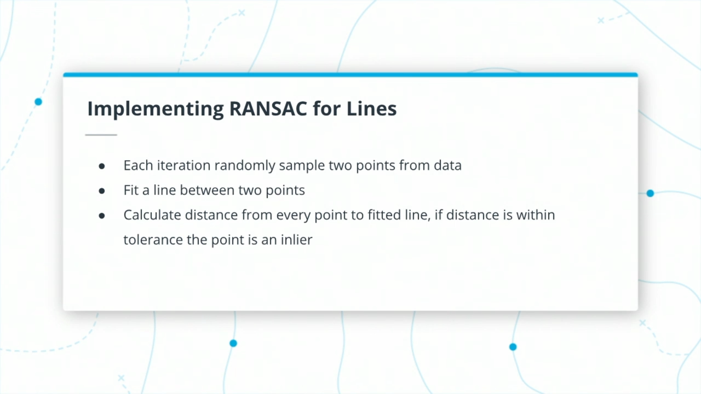
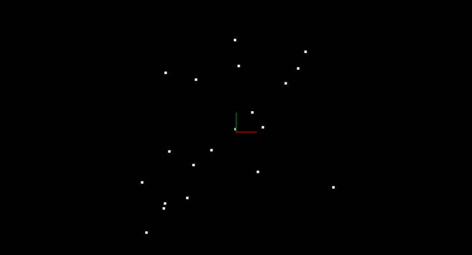

在本节课中，您将使用Ransac和一个平面模型来分割点云数据，并将其分为属于道路的点和不属于道路的点。

# 1. Segmentation

我们想在场景中找到障碍物。然而，我们场景的一些物体并不是障碍物。PCD中出现但不是障碍物的对象是什么？在大多数情况下，道路上的任何自由空间都不是障碍物，如果道路平坦，从非道路点选择道路点就相当简单。为此，我们将使用一种称为**平面分割的方法，该方法使用RANSAC（随机样本一致性）算法**。

# 2. Michael on Detection and Segmentation

### How do you use lidar to detect objects in the environment?
工程师们通过记录激光雷达的信号来使用我们之前提到过的激光雷达。我们记录所有返回激光雷达的数据。我们是否从中创建对象，取决于我们可以直接用点云做事情的特定用例。然后我们可以使用这些对象跟踪这些对象，进行预测，以及它们的作用。我们可以用它来分类物体。我们有一些类，激光雷达使用神经网络可以检测和区分。

### What is segmentation?
分割是说，好吧，这个特定的东西属于一个对象。这属于地平面，这属于一棵树。所以你把**某些点和物体联系起来**，然后说，好的，这是一个物体，那一组点，这是另一个物体，一组物体或者另一个物体。这就是它的基本工作原理。

# 3. Point Processing

首先，我们将构建自己的点处理器。在上一课中，我们研究了`point processor.cpp`的代码。现在，我们实际上要实例化它，并开始填充它的一些函数。所以要做这个练习，基本上，我们将从创建一个点处理器开始。您可能还记得我们正在使用`environment.cpp`，并在其中填充了一些对象。例如，我们上次创建了一个激光雷达，我们正在用它扫描，我们已经创建了一些点云，我们可视化它们。现在，我们实际上要创建一个点处理器对象，就在我们前面创建激光雷达的工作的下面。在我们创建了那个点处理器之后，我们将研究填充它的一些功能。点处理器所具有的功能只是提醒您正在进行一些过滤、分割，我们将在本课稍后的聚类部分中学习这些功能，它还具有加载和保存PCD文件的功能。点处理器也使用模板，因为我们有不同的点云类型。所以在这个模拟环境中，我们使用的是PointXYZ。


所以对于这个练习，基本上我希望你做的是在`environment.cpp`中有一个TODO来创建一个点处理器，你可以用两种方式实例化它。您可以在堆或栈上实例化它，具体取决于您自己。如果您查看point processor，`ProcessPointClouds.cpp`，可以看到它是一个类。您还可以查看不同的实例化方法。因此，对于这里的练习，基本上，创建一个点处理器，并确保可以编译和运行模拟器。

## Creating Point Processor

您要做的第一件事是创建一个`ProcessPointClouds`对象。这是由`src/processpointclouds.cpp`和`src/processpointclouds.h`文件定义的。此对象将包含您将在此模块中用于处理激光雷达数据的所有方法。Process对象还具有用于加载和保存PCD文件的帮助器方法。当您完成这个练习时，代码应该编译，但是您仍然需要在获得结果之前完成接下来的几个概念。

## Instructions
- 打开`src/environment.cpp`文件。
- 在函数`simpleHighway`中，创建一个`processPointClouds`对象。您可以在栈或堆上执行此操作。
- 处理器应该使用点云类型`pcl:：PointXYZ`。
  
## Solution
```diff
diff --git a/src/environment.cpp b/src/environment.cpp
index 149d18d..dce4675 100644
--- a/src/environment.cpp
+++ b/src/environment.cpp
@@ -53,7 +53,8 @@ void simpleHighway(pcl::visualization::PCLVisualizer::Ptr& viewer)
     renderPointCloud(viewer, inputCloud, "inputCloud");

     // TODO:: Create point processor
-  
+    ProcessPointClouds<pcl::PointXYZ> processPoint;
+    // ProcessPointClouds<pcl::PointXYZ> *processPointClouds = new ProcessPointClouds<pcl::PointXYZ>();
 }
```

# 4. Segmenting the Plane with PCL

在点处理器类中，实际上有一个方法来执行分割平面。我们在填写时会考虑这个问题。这里需要注意的是，我们将使用一个模板，所以pointT来表示任何类型的点云，这里我们要做的是point XYZ，我们将有一些与此相关的参数，并且在距离公差中有这些最大迭代。所以我们将更多地讨论这个问题，以及它如何影响我们正在生成的数据。但基本上，我们将创建这个inliner列表，这个列表将包含它的elicit-ints。所有的指数都来自于那个点云，它实际上属于这个平面。这就是我们要从这个函数中生成的


## Using PCL to segment Plane

在本练习中，将从场景中的点中分离出属于道路的点。

## The SegmentPlane Function Stub
现在让我们使用点处理器。

您将在`src/processPointClouds.cpp`中定义`SegmentPlane`函数。这个函数已经有了一个声明，您只需要填写定义。在函数的顶部，您会注意到一个模板参数`pointT`。您将使用它作为一个变量来表示任何类型的点云，并且在以后处理具有强度值的点云时，它将非常有用。

## SegmentPlane Function Signature

```c++
std::pair<typename pcl::PointCloud<PointT>::Ptr, typename pcl::PointCloud<PointT>::Ptr> SegmentPlane(typename pcl::PointCloud<PointT>::Ptr cloud, int maxIterations, float distanceThreshold);
```

函数接受点云、最大迭代次数和距离公差作为参数。分割使用迭代过程。更多的迭代有机会返回更好的结果，但需要更长的时间。
- 分割算法**将平面拟合到点**，
- 并使用**距离公差来确定哪些点属于该平面**。
- **公差越大，平面上的点就越多**。

看看上面代码中的返回类型。`SegmentPlane`将返回一个`std::pair`保持点云指针类型。如果您不熟悉`pairs`，请查看[此处](http://www.cplusplus.com/reference/utility/pair/pair/)的文档。您将使用pair对象保存障碍点云和道路点云的分割结果。这样，您以后可以在PCL查看器中可视化这两个点云并分析结果。

```cc
// pair::pair example
#include <utility>      // std::pair, std::make_pair
#include <string>       // std::string
#include <iostream>     // std::cout

int main () {
  std::pair <std::string,double> product1;                     // default constructor
  std::pair <std::string,double> product2 ("tomatoes",2.30);   // value init
  std::pair <std::string,double> product3 (product2);          // copy constructor

  product1 = std::make_pair(std::string("lightbulbs"),0.99);   // using make_pair (move)

  product2.first = "shoes";                  // the type of first is string
  product2.second = 39.90;                   // the type of second is double

  std::cout << "The price of " << product1.first << " is $" << product1.second << '\n';
  std::cout << "The price of " << product2.first << " is $" << product2.second << '\n';
  std::cout << "The price of " << product3.first << " is $" << product3.second << '\n';
  return 0;
}
```
```
The price of lightbulbs is $0.99
The price of shoes is $39.9
The price of tomatoes is $2.3
```
## SegmentPlane Body

```c++
// Time segmentation process
auto startTime = std::chrono::steady_clock::now();

// TODO:: Fill in the function to segment cloud into two parts, the drivable plane and obstacles

auto endTime = std::chrono::steady_clock::now();
auto elapsedTime = std::chrono::duration_cast<std::chrono::milliseconds>(endTime - startTime);
std::cout << "plane segmentation took " << elapsedTime.count() << " milliseconds" << std::endl;
```

在上面的代码中，在`SegmentPlane`函数`stub`中看到的第一件事是一个计时器。这对于测量运行函数所需的时间很有用。如果要花很长时间来处理分割，那么在自动驾驶汽车上实时运行该功能就没有用处了。

## Instructions
要开始填充函数，可以使用PCL的分割对象。请参阅[PCL分割教程](http://pointclouds.org/documentation/tutorials/extract_indices.php#extract-indices)，以供参考。尤其是查看第38-48行。查看下面的walkthrough了解这些行的解释，并尝试自己在工作区中实现它们。

```cc
// 38~48

pcl::ModelCoefficients::Ptr coefficients (new pcl::ModelCoefficients ());
pcl::PointIndices::Ptr inliers (new pcl::PointIndices ());
// Create the segmentation object
pcl::SACSegmentation<pcl::PointXYZ> seg;
// Optional
seg.setOptimizeCoefficients (true);
// Mandatory
seg.setModelType (pcl::SACMODEL_PLANE);
seg.setMethodType (pcl::SAC_RANSAC);
seg.setMaxIterations (1000);
seg.setDistanceThreshold (0.01);
```

## PCL Segment Tutorial
- [Extracting indices from a PointCloud](http://pointclouds.org/documentation/tutorials/extract_indices.php#extract-indices)
- [Plane model segmentation](http://pointclouds.org/documentation/tutorials/planar_segmentation.php#planar-segmentation)

## Solution

```diff
diff --git a/src/processPointClouds.cpp b/src/processPointClouds.cpp
index 90f8fac..66993a6 100644
--- a/src/processPointClouds.cpp
+++ b/src/processPointClouds.cpp
@@ -53,8 +53,25 @@ std::pair<typename pcl::PointCloud<PointT>::Ptr, typename pcl::PointCloud<PointT
 {
     // Time segmentation process
     auto startTime = std::chrono::steady_clock::now();
-       pcl::PointIndices::Ptr inliers;
+       pcl::PointIndices::Ptr inliers (new pcl::PointIndices ());
     // TODO:: Fill in this function to find inliers for the cloud.
+    pcl::ModelCoefficients::Ptr coefficients (new pcl::ModelCoefficients ());
+    // Create the segmentation object
+    pcl::SACSegmentation<PointT> seg;
+    // Optional
+    seg.setOptimizeCoefficients (true);
+    // Mandatory
+    seg.setModelType(pcl::SACMODEL_PLANE); 
+    seg.setMethodType (pcl::SAC_RANSAC);
+    seg.setMaxIterations (maxIterations);
+    seg.setDistanceThreshold (distanceThreshold);
+    
+    // Segment the largest planar component from the remaining cloud
+    seg.setInputCloud (cloud);
+    seg.segment (*inliers, *coefficients);
+    if (inliers->indices.size () == 0) {
+      std::cerr << "Could not estimate a planar model for the given dataset." << std::endl;
+    }
```
# 5. Separating Point Clouds

在上一个练习中，您获得了作为拟合平面索引的inliers。现在，您将使用这些inlier来创建平面点云和障碍点云。



## Instructions

您可以通过从`processPointCloud`调用`SeparateClouds`函数来分离点云。您可以在`SegmentPlane`内部使用此函数，并计算得出的`inlier`和`input cloud`。

在`SeparateClouds`函数stub内部，创建两个新的点云指针，一个用于障碍物（非平面点），另一个用于道路（平面点）。可以通过遍历`inlier`索引并**将相应的线性点推入平面云的点向量中**，从而将`inlier`点添加到plane cloud's vector中。

要生成obstacle cloud，一种使用PCL进行此操作的方法是使用`extract`对象，该对象**从输入云中减去平面云**。现在，您可以返回`std::pair`与新创建的障碍物和平面云：

```cc
std::pair<typename pcl::PointCloud<PointT>::Ptr, typename pcl::PointCloud<PointT>::Ptr> segResult(obstCloud,planeCloud);
```

pcl分割教程显示了如何在第67-70行中使用提取对象。
```cc
// Extract the inliers
extract.setInputCloud (cloud_filtered);
extract.setIndices (inliers);
extract.setNegative (false);
extract.filter (*cloud_p);
```
返回`environment.cpp`，然后可以在输入云上调用`pointProcessor`函数，并以不同的颜色渲染两个分割的点云。

```cc
std::pair<pcl::PointCloud<pcl::PointXYZ>::Ptr, pcl::PointCloud<pcl::PointXYZ>::Ptr> segmentCloud = pointProcessor->SegmentPlane(inputCloud, 100, 0.2);
renderPointCloud(viewer,segmentCloud.first,"obstCloud",Color(1,0,0));
renderPointCloud(viewer,segmentCloud.second,"planeCloud",Color(0,1,0));
```

## 注意
上面的示例使用了100次迭代，距离公差为0.2米。强烈建议您尝试并实验这些值！ 这个点云非常简单，并且100次迭代远远超出了需要。您还可以使用预定义的timer log功能监视迭代的更改如何影响分割功能处理时间。

在渲染这两个云之前，您需要记住要关闭上一课中输入云的渲染，否则云将全部重叠，并且很难区分分割的云。`renderPointCloud`函数包括颜色选项（红色，绿色，蓝色）。 默认情况下，如果未指定颜色，则云为白色。 在这里，障碍物云被渲染为红色，而平面云被渲染为绿色。



## Solution

```cc
diff --git a/src/environment.cpp b/src/environment.cpp
index eaec2ca..3c6f142 100644
--- a/src/environment.cpp
+++ b/src/environment.cpp
@@ -49,11 +49,15 @@ void simpleHighway(pcl::visualization::PCLVisualizer::Ptr& viewer)
     Lidar *pLidar = new Lidar(cars, 0.0);
     pcl::PointCloud<pcl::PointXYZ>::Ptr cloud = pLidar->scan();
     // renderRays(viewer, pLidar->position, cloud);
-    renderPointCloud(viewer, cloud, "PointCloud");
+    // renderPointCloud(viewer, cloud, "PointCloud");

     // TODO:: Create point processor
     ProcessPointClouds<pcl::PointXYZ> process;
     // ProcessPointClouds<pcl::PointXYZ> *processPointClouds = new ProcessPointClouds<pcl::PointXYZ>();
+    
+    std::pair<pcl::PointCloud<pcl::PointXYZ>::Ptr, pcl::PointCloud<pcl::PointXYZ>::Ptr> segmentCloud = process.SegmentPlane(cloud, 100, 0.2);
+    renderPointCloud(viewer,segmentCloud.first,"obstCloud",Color(1,0,0));
+    renderPointCloud(viewer,segmentCloud.second,"planeCloud",Color(0,1,0));
 }


diff --git a/src/processPointClouds.cpp b/src/processPointClouds.cpp
index 66993a6..8405b03 100644
--- a/src/processPointClouds.cpp
+++ b/src/processPointClouds.cpp
@@ -42,8 +42,20 @@ template<typename PointT>
 std::pair<typename pcl::PointCloud<PointT>::Ptr, typename pcl::PointCloud<PointT>::Ptr> ProcessPointClouds<PointT>::SeparateClouds(pcl::PointIndices::Ptr inliers, typename pcl::PointCloud<PointT>::Ptr cloud)
 {
   // TODO: Create two new point clouds, one cloud with obstacles and other with segmented plane
-
-    std::pair<typename pcl::PointCloud<PointT>::Ptr, typename pcl::PointCloud<PointT>::Ptr> segResult(cloud, cloud);
+    typename pcl::PointCloud<PointT>::Ptr cloud_obstacles (new pcl::PointCloud<PointT>), cloud_plane (new pcl::PointCloud<PointT>);
+    // Create the filtering object
+    pcl::ExtractIndices<PointT> extract;
+    // Extract the inliers
+    extract.setInputCloud (cloud);
+    extract.setIndices (inliers);
+    extract.setNegative (false);
+    extract.filter (*cloud_plane);
+
+    // Create the filtering object
+    extract.setNegative (true);
+    extract.filter (*cloud_obstacles);
+
+    std::pair<typename pcl::PointCloud<PointT>::Ptr, typename pcl::PointCloud<PointT>::Ptr> segResult(cloud_obstacles, cloud_plane);
     return segResult;
 }
```
# 6. RANSAC

RANSAC代表随机抽样一致性算法（Random Sample Consensus），是一种检测数据中异常值的方法。  RANSAC运行最大迭代次数，然后返回最合适的模型。 每次迭代都会随机选择数据的子样本，并通过它拟合模型，例如直线或平面。 然后，将具有最多的inliers数目或最低的噪声的迭代用作最佳模型。




> RANSAC algorithm for line fitting with outliers

一种类型的RANSAC选择适合的最小点子集来拟合。 对于一条线，这将是两个点，对于一个平面，则将是三个点。 然后，通过迭代遍历每个剩余点并计算其与模型的距离，来计算inliers数量。距模型一定距离内的点计为Inliers。那么，**具有最大inliers的数量就是最佳模型**。 这将是您在本测验中实现的版本。

RANSAC的其他方法可以对一定比例的模型点（例如，总点数的20％）进行采样，然后对其拟合一条线。 然后计算该行的误差，误差最小的迭代就是最佳模型。由于不需要每次迭代考虑每个点，因此该方法可能具有一些优点。尝试不同的方法和时间结果，看看哪种方法最有效是个好习惯。

# 7. Implementing RANSAC for Lines



在这里，您将完成一个测验，该测验已实现RANSAC，以将有outliers的2D点数据中拟合为一条线。测验位于`src/quiz/ransac/ransac2d.cpp`中，要填写的函数是`Ransac`，它接受点云，运行的最大迭代次数和距离容差的参数。点云实际上是`pcl::PointXYZ`，但是`z`分量将设置为零，以使事物在2D空间中易于可视化。

下面显示的数据是通过稍微分散点来创建一条线，然后通过在场景中随机放置点来添加outliers。您希望能够识别哪些点属于最初生成的线，哪些点是outliers。为此，您将从云中随机采样两个点，并在这些点之间拟合一条线。下面可以看到一个有用的线性方程式。

## Point Data



> Simple 2D Point Cloud Data

## RANSAC Implementation

### Equation of a Line Through Two Points in 2D

对于变量x、y和系数A、B、C，直线的一般方程为:

$$
A x+B y+C=0
$$

给定两个点：`point1(x1，y1)`和`point2(x2，y2)`，通过point1和point2的线具有以下特定形式：

$$
(y 1-y 2) x+(x 2-x 1) y+(x 1 * y 2-x 2 * y 1)=0
$$

### Using Distance to Find the Best Line

拟合直线后，您可以遍历所有点，并通过测量每个点与直线的距离来确定它们是否为inliers。您可以为每次迭代执行此操作，以跟踪哪个拟合线具有最多的inliers数。inliers最多的线将是最佳模型。下面显示了计算点与线之间的距离的公式。 有关更多详细信息，请参见: https://brilliant.org/wiki/dot-product-distance-between-point-and-a-line/

- Line formula $A x+B y+C=0$
- Point $(x, y)$
- Distance $d=|A x+B y+C| / \operatorname{sqrt}\left(A^{2}+B^{2}\right)$

以下是使用RANSAC拟合上面数据中的一条线的结果。inliers为绿色，而outliers为红色。 该函数的最大迭代计数为50，距离容差为0.5。要运行的最大迭代大小取决于inliers与点总数的比率。我们的数据包含的inlier越多，选择可以拟合直线的inlier的可能性就越高，而获得良好的选择良好模型的可能性所需的迭代次数也就越少。


> Fitted Line using RANSAC

### Instructions
- Go to `src/quiz/ransac/ransac2d.cpp`
- Complete the function `Ransac` following the instructions above

### Compile/Run
- Go to src/quiz/ransac
- mkdir build
- cd build
- cmake ..
- make
- ./quizRansac

## Solution

```diff
diff --git a/src/quiz/ransac/ransac2d.cpp b/src/quiz/ransac/ransac2d.cpp
index e05f732..ce23a79 100644
--- a/src/quiz/ransac/ransac2d.cpp
+++ b/src/quiz/ransac/ransac2d.cpp
@@ -67,62 +67,16 @@ std::unordered_set<int> Ransac(pcl::PointCloud<pcl::PointXYZ>::Ptr cloud, int ma
        srand(time(NULL));

        // TODO: Fill in this function
-       double bestA = 0;
-       double bestB = 0;
-       double bestC = 0;
-       double bestN = 0;
-       int maxNumberOfInliers = 0;
+
        // For max iterations
-       for (int i = 0; i < maxIterations; ++i) {
+
        // Randomly sample subset and fit line
-               int indexP = rand() % cloud->points.size();
-               int indexQ = rand() % cloud->points.size();
-               while (indexP == indexQ) {
-                       indexP = rand() % cloud->points.size();
-               }
-               cout << "index_p: " << indexP << endl;
-               cout << "index_q: " << indexQ << endl;
-
-               double x1 = cloud->points[indexP].x;
-               double y1 = cloud->points[indexP].y;
-               double x2 = cloud->points[indexQ].x;
-               double y2 = cloud->points[indexQ].y;
-
-               double A = y1 - y2;
-               double B = x2 - x1;
-               double C = x1 * y2 - x2 * y1;
-               double N = sqrt(A*A + B*B);
-       // Measure distance between every point and fitted line
-               int numberOfInliers = 0;
-               for (auto point : cloud->points) {
-                       double x = point.x;
-                       double y = point.y;

-                       double d = abs(A * x + B * y + C) / N;
+       // Measure distance between every point and fitted line
        // If distance is smaller than threshold count it as inlier
-                       if (d <= distanceTol) {
-                               numberOfInliers++;
-                       }
-               }
-               if (numberOfInliers > maxNumberOfInliers) {
-                       maxNumberOfInliers = numberOfInliers;
-                       bestA = A;
-                       bestB = B;
-                       bestC = C;
-                       bestN = N;
-               }
-       }
-       // Return indicies of inliers from fitted line with most inliers
-       for (auto i = 0; i != cloud->points.size(); ++i) {
-               double x = cloud->points[i].x;
-               double y = cloud->points[i].y;
-
-               double d = abs(bestA * x + bestB * y + bestC) / bestN;
-               if (d < distanceTol) {
-                       inliersResult.insert(i);
-               }
-       }

+       // Return indicies of inliers from fitted line with most inliers
+       
        return inliersResult;

 }
@@ -138,7 +92,7 @@ int main ()


        // TODO: Change the max iteration and distance tolerance arguments for Ransac function
-       std::unordered_set<int> inliers = Ransac(cloud, 50, 0.5);
+       std::unordered_set<int> inliers = Ransac(cloud, 0, 0);

        pcl::PointCloud<pcl::PointXYZ>::Ptr  cloudInliers(new pcl::PointCloud<pcl::PointXYZ>());
        pcl::PointCloud<pcl::PointXYZ>::Ptr cloudOutliers(new pcl::PointCloud<pcl::PointXYZ>());
```
# 8. Extending RANSAC to Planes

## Extending RANSAC to Plane

现在您已经掌握了RANSAC的精髓，并且了解了RANSAC拟合直线的方法，您可以为在3D点云中拟合平面执行相同的操作。您的实现将用作项目的一部分，因此请确保在下面的练习中完成实现！

如果您已完成上一个练习，则可以通过使用三个点的平面方程式以及一个点到平面的距离公式来修改代码。

## Equation of a Plane through Three Points

Equation of a Plane through Three Points

$A x+B y+C z+D=0$

- point $1=(x 1, y 1, z 1)$  
- point $2=(x 2, y 2, z 2)$  
- point $3=(x 3, y 3, z 3)$  

使用$point1$作为参考，并在平面$v1$和$v2$上定义两个向量，如下所示：
- 向量$v1$从$point1$到达$point2$ 
- 向量$v2$从$point1$到达$point3$

$
\begin{array}{l}
v 1=<x 2-x 1, y 2-y 1, z 2-z 1> \\
v 2=<x 3-x 1, y 3-y 1, z 3-z 1>
\end{array}
$

通过取 $v1\times v2$ 的叉积来求平面的法线向量：

$v 1 \times v 2=<(y 2-y 1)(z 3-z 1)-(z 2-z 1)(y 3-y 1)$  
$(z 2-z 1)(x 3-x 1)-(x 2-x 1)(z 3-z 1)$  
$(x 2-x 1)(y 3-y 1)-(y 2-y 1)(x 3-x 1)>$  

为了简化符号，我们可以把它写成这种形式

$v 1 \times v 2=<i, j, k>$

然后

$i(x-x 1)+j(y-y 1)+k(z-z 1)=0$  
$i x+j y+k z-(i x 1+j y 1+k z 1)=0$  
$A=i$  
$B=j$  
$C=k$  
$D=-(i x 1+j y 1+k z 1)$

## Distance between point and plane

- https://mathinsight.org/distance_point_plane

如果平面是

$A x+B y+C z+D=0$

然后给定一个点$(x,y,z)$，从该点到平面的距离为:

$d=|A x+B y+C * z+D| / s q r t\left(A^{2}+B^{2}+C^{2}\right)$

实施RANSAC时，请尝试计时执行时间，并将其时间与PCL内置的RANSAC功能进行比较。

## Instructions

- 在下面的工作区中，更改第99行以使用`CreateData3D`。
  ```cc
  // Create data
  pcl::PointCloud<pcl::PointXYZ>::Ptr cloud = CreateData3D();
  ```
- `Ransac`平面拟合工作正常后，复制代码并将其扩展到`pointProcessor`，`Segment`函数
- 修改`Ransac`函数或创建一个新的`RansacPlane`函数，并使用与以前相同的实现，但现在使用`Plane`和`Point`公式。

## Solution

```diff
diff --git a/src/quiz/ransac/ransac2d.cpp b/src/quiz/ransac/ransac2d.cpp
index e05f732..1c93fbc 100644
--- a/src/quiz/ransac/ransac2d.cpp
+++ b/src/quiz/ransac/ransac2d.cpp
@@ -127,6 +127,59 @@ std::unordered_set<int> Ransac(pcl::PointCloud<pcl::PointXYZ>::Ptr cloud, int ma

 }

+std::unordered_set<int> RansacPlane(pcl::PointCloud<pcl::PointXYZ>::Ptr cloud, int maxIterations, float distanceTol)
+{
+       std::unordered_set<int> inliersResult;
+       srand(time(NULL));
+
+       for (int i = 0; i < maxIterations; ++i) {
+               std::unordered_set<int> inliers;
+               while (inliers.size() < 3) {
+                       inliers.insert(rand() % (cloud->points.size()));
+               }
+
+               double x1, y1, z1, x2, y2, z2, x3, y3, z3;
+               auto iter = inliers.begin();
+               pcl::PointXYZ point = cloud->points[*iter++];
+               x1 = point.x;
+               y1 = point.y;
+               z1 = point.z;
+               point = cloud->points[*iter++];
+               x2 = point.x;
+               y2 = point.y;
+               z2 = point.z;
+               point = cloud->points[*iter];
+               x3 = point.x;
+               y3 = point.y;
+               z3 = point.z;
+
+               double A = (y2 - y1) * (z3 - z1) - (z2 - z1) * (y3 - y1);
+               double B = (z2 - z1) * (x3 - x1) - (x2 - x1) * (z3 - z1);
+               double C = (x2 - x1) * (y3 - y1) - (y2 - y1) * (x3 - x1);
+               double D = -(A * x1 + B * y1 + C * z1);
+               double N = sqrt(A * A + B * B + C * C);
+
+               for (int index = 0; index < cloud->points.size(); ++index) {
+                       if (inliers.count(index) > 0)
+                               continue;
+                       point = cloud->points[index];
+                       double x = point.x;
+                       double y = point.y;
+                       double z = point.z;
+                       double d = abs(A * x + B * y + C * z + D) / N;
+
+                       if (d <= distanceTol)
+                               inliers.insert(index);
+               }
+
+               if (inliers.size() > inliersResult.size()) {
+                       inliersResult = inliers;
+               }
+       }
+
+       return inliersResult;
+}
+
 int main ()
 {

@@ -134,11 +187,13 @@ int main ()
        pcl::visualization::PCLVisualizer::Ptr viewer = initScene();

        // Create data
-       pcl::PointCloud<pcl::PointXYZ>::Ptr cloud = CreateData();
+       //pcl::PointCloud<pcl::PointXYZ>::Ptr cloud = CreateData();
+       pcl::PointCloud<pcl::PointXYZ>::Ptr cloud = CreateData3D();


        // TODO: Change the max iteration and distance tolerance arguments for Ransac function
-       std::unordered_set<int> inliers = Ransac(cloud, 50, 0.5);
+       //std::unordered_set<int> inliers = Ransac(cloud, 50, 0.5);
+       std::unordered_set<int> inliers = RansacPlane(cloud, 50, 0.2);

        pcl::PointCloud<pcl::PointXYZ>::Ptr  cloudInliers(new pcl::PointCloud<pcl::PointXYZ>());
        pcl::PointCloud<pcl::PointXYZ>::Ptr cloudOutliers(new pcl::PointCloud<pcl::PointXYZ>());
```