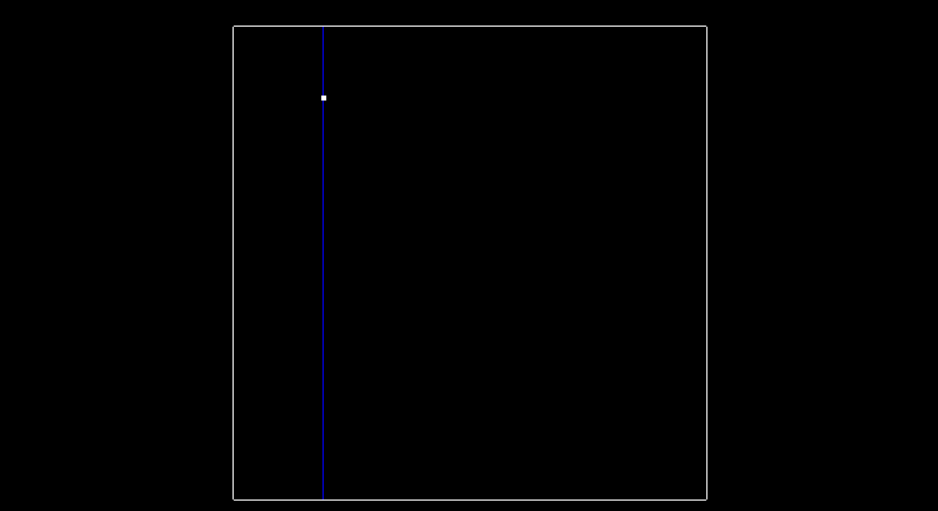
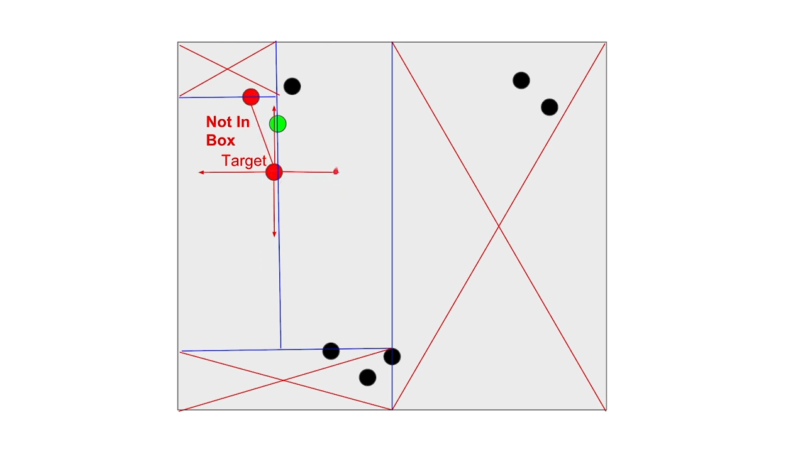

执行欧几里得聚类，并学习如何构建KD-Tree以使用它们进行聚类的高效最近邻搜索。

# 1. What is Clustering?


聚类就是你有一堆点，在它们的周围画一个边界，然后说，这就是car，或者这就行行人

# 2. Clustering Obstacles


## Overview for Clustering

您可以使用一种方法来分割点，并识别哪些点代表您的汽车的障碍物。最好将这些障碍点分开并分组，特别是如果您想与汽车，行人和骑自行车的人进行多对象跟踪时，尤其如此。进行分组和聚类点云数据的一种方法称为**欧几里得聚类**。

## Euclidean Clustering

这个想法是根据点之间的紧密程度来关联一组点。为了有效地进行最近邻居搜索，可以使用KD-Tree数据结构，该数据结构平均可以将查找时间从O(n)加快到O(log(n))。 这是因为树使您可以更好地分解搜索空间。通过将点分组到KD-tree中的区域中，您可以避免计算可能成千上万个点的距离，这仅仅是因为您知道它们甚至没有在足够近的区域中被考虑。

在本课程中，您将首先了解如何使用内置PCL函数进行欧几里得聚类。接下来，您将使用KD-Tree编写自己的聚类算法。您的实现将在项目提交中使用，因此请确保在随后的练习中完成实现！

# 3. Euclidean Clustering with PCL


在`pointProcessor`内部，`Clustering`函数位于您之前使用的`SegmentPlane`函数的正下方。

PCL为使用其内置的欧几里得聚类功能提供了一些[文档](http://pointclouds.org/documentation/tutorials/cluster_extraction.php)。特别要检查71-82行。

```cc
// Creating the KdTree object for the search method of the extraction
pcl::search::KdTree<pcl::PointXYZ>::Ptr tree (new pcl::search::KdTree<pcl::PointXYZ>);
tree->setInputCloud (cloud_filtered);

std::vector<pcl::PointIndices> cluster_indices;
pcl::EuclideanClusterExtraction<pcl::PointXYZ> ec;
ec.setClusterTolerance (0.02); // 2cm
ec.setMinClusterSize (100);
ec.setMaxClusterSize (25000);
ec.setSearchMethod (tree);
ec.setInputCloud (cloud_filtered);
ec.extract (cluster_indices);
```

## Euclidean Clustering Arguments

欧几里德聚类对象`ec`根据**距离公差**。该距离内的任何点将被分组在一起。它还具有用于表示为聚类点的数量的**min和max参数**。这个想法是：如果聚类真的很小，那可能只是噪音而我们可以忽略。同样，最大数量的点允许我们更好地分解非常大的聚类。如果聚类非常大，则可能是许多其他聚类重叠，并且max容差可以帮助我们更好地解决对象检测问题。欧几里得聚类对象的最后一个参数是**Kd-Tree**。使用**输入云点创建和构建树**，在这种情况下，它们将成为障碍物点云。

回到`environment.cpp`，让我们看看如何渲染不同的聚类。
```cc
std::vector<pcl::PointCloud<pcl::PointXYZ>::Ptr> cloudClusters = pointProcessor->Clustering(segmentCloud.first, 1.0, 3, 30);

int clusterId = 0;
std::vector<Color> colors = {Color(1,0,0), Color(0,1,0), Color(0,0,1)};

for(pcl::PointCloud<pcl::PointXYZ>::Ptr cluster : cloudClusters)
{
      std::cout << "cluster size ";
      pointProcessor->numPoints(cluster);
      renderPointCloud(viewer,cluster,"obstCloud"+std::to_string(clusterId),colors[clusterId]);
      ++clusterId;
}
```
在上面的代码中，调用了`Clustering`方法，然后有一个循环遍历每个聚类并在每个聚类上调用`renderPointCloud`。`renderPointCloud`期望每个pcl查看器点云都**具有唯一的标识符**，因此聚类使用`clusterId`进行计数并附加到`obstCloud`字符串中。

为了获得每个聚类的不同颜色，定义了颜色列表。在这里，我们仅使用红色，蓝色和绿色。

作为奖励，记录了每个聚类的点数。稍后在尝试选择良好的最小和最大点值时，这可能是有用的调试工具。

在此示例中，将聚类的最小点设置为3，将最大值设置为30。距离容差也设置为1。需要一些时间和精力来选择良好的超参数，但实际上很多情况下不会是获得完美结果的完美组合以。

## Cluster Results


> Clusters shown in different colors, red, green, and blue.

## Instructions
- 使用上面的pcl文档指南作为参考，在`pointProcessor`中定义函数聚类。
- 针对聚类算法尝试不同的超参数。
- 在`environment.cpp`中，使用上面的代码示例渲染不同的聚类。

## Solution

```diff
diff --git a/src/environment.cpp b/src/environment.cpp
index d7d0e5d..9a2edd2 100644
--- a/src/environment.cpp
+++ b/src/environment.cpp
@@ -52,12 +52,25 @@ void simpleHighway(pcl::visualization::PCLVisualizer::Ptr& viewer)
     // renderPointCloud(viewer, cloud, "PointCloud");

     // TODO:: Create point processor
-    ProcessPointClouds<pcl::PointXYZ> process;
-    // ProcessPointClouds<pcl::PointXYZ> *processPointClouds = new ProcessPointClouds<pcl::PointXYZ>();
+    // ProcessPointClouds<pcl::PointXYZ> process;
+    ProcessPointClouds<pcl::PointXYZ> *pointProcessor = new ProcessPointClouds<pcl::PointXYZ>();

-    std::pair<pcl::PointCloud<pcl::PointXYZ>::Ptr, pcl::PointCloud<pcl::PointXYZ>::Ptr> segmentCloud = process.SegmentPlane(cloud, 100, 0.2);
-    renderPointCloud(viewer,segmentCloud.first,"obstCloud",Color(1,0,0));
-    renderPointCloud(viewer,segmentCloud.second,"planeCloud",Color(0,1,0));
+    std::pair<pcl::PointCloud<pcl::PointXYZ>::Ptr, pcl::PointCloud<pcl::PointXYZ>::Ptr> segmentCloud = pointProcessor->SegmentPlane(cloud, 100, 0.2);
+    renderPointCloud(viewer,segmentCloud.first,"obstCloud",Color(1,0,1));
+    renderPointCloud(viewer,segmentCloud.second,"planeCloud",Color(1,1,1));
+
+    std::vector<pcl::PointCloud<pcl::PointXYZ>::Ptr> cloudClusters = pointProcessor->Clustering(segmentCloud.first, 0.1, 3, 100);
+
+    int clusterId = 0;
+    std::vector<Color> colors = {Color(1,0,0), Color(0,1,0), Color(0,0,1)};
+
+    for(pcl::PointCloud<pcl::PointXYZ>::Ptr cluster : cloudClusters)
+    {
+        std::cout << "cluster size ";
+        pointProcessor->numPoints(cluster);
+        renderPointCloud(viewer,cluster,"obstCloud"+std::to_string(clusterId),colors[clusterId]);
+        ++clusterId;
+    }
 }

 
diff --git a/src/processPointClouds.cpp b/src/processPointClouds.cpp
index 8405b03..16d623c 100644
--- a/src/processPointClouds.cpp
+++ b/src/processPointClouds.cpp
@@ -104,6 +104,28 @@ std::vector<typename pcl::PointCloud<PointT>::Ptr> ProcessPointClouds<PointT>::C
     std::vector<typename pcl::PointCloud<PointT>::Ptr> clusters;

     // TODO:: Fill in the function to perform euclidean clustering to group detected obstacles
+    // Creating the KdTree object for the search method of the extraction
+    typename pcl::search::KdTree<PointT>::Ptr tree (new pcl::search::KdTree<PointT>);
+    tree->setInputCloud (cloud);
+
+    std::vector<pcl::PointIndices> cluster_indices;
+    pcl::EuclideanClusterExtraction<PointT> ec;
+    ec.setClusterTolerance (clusterTolerance);
+    ec.setMinClusterSize (minSize);
+    ec.setMaxClusterSize (maxSize);
+    ec.setSearchMethod (tree);
+    ec.setInputCloud (cloud);
+    ec.extract (cluster_indices);
+
+    for (std::vector<pcl::PointIndices>::const_iterator it = cluster_indices.begin (); it != cluster_indices.end (); ++it) {
+        typename pcl::PointCloud<PointT>::Ptr cloud_cluster (new pcl::PointCloud<pcl::PointXYZ>);
+        for (std::vector<int>::const_iterator pit = it->indices.begin (); pit != it->indices.end (); ++pit)
+            cloud_cluster->points.push_back (cloud->points[*pit]);
+        cloud_cluster->width = cloud_cluster->points.size ();
+        cloud_cluster->height = 1;
+        cloud_cluster->is_dense = true;
+        clusters.push_back(cloud_cluster);
+    }

     auto endTime = std::chrono::steady_clock::now();
     auto elapsedTime = std::chrono::duration_cast<std::chrono::milliseconds>(endTime - startTime);
```


# 4. Implementing KD-Tree

## Implementing KD Tree


KD-树是二叉树，它在交替的坐标轴之间分割点。通过使用**区域划分来分隔空间**，使用像欧几里得聚类这样的算法可以使最近邻居搜索更快。在本测验中，您将看到一个2D示例，因此树将是2D-Tree。在测验的第一部分中，您将从`src/quiz/cluster/kdtree.h`开始工作，并填写函数`insert`，该函数传入一个2D点，该2D点由包含两个浮点的vector和一个点ID表示。ID是一种唯一标识点的方法，也是一种确定从整个点云中引用该点的索引的方法。为了完成`insert`函数，我们首先讨论一下KD-Tree如何拆分信息。

## Inserting Points into the Tree

### Data

> 2D points to cluster

### Building KD-Tree

上图显示了2D点的外观。 在这个简单的示例中，只有11个点，并且存在三个群集，这些群集的点彼此接近。 稍后您将找到这些集群。


在`src/quiz/cluster/cluster.cpp`中，有一个函数用于在将点插入树后渲染树。 下图显示了行间距，其中蓝线**将x个区域拆分**，红线**将y个区域拆分**。该图显示了在插入所有11个点之后树的外观，您将编写代码以在下一个概念中执行此操作。

### Built KD-Tree


> Tree separating x and y regions.

# 5. Inserting Points into KD-Tree


现在，让我们讨论一下树是如何精确创建的。在树为空的最开始，根为NULL。插入的点成为根，并分割x区域。这是插入第一个点（-6.2，7）后的外观。

## First Point


> Insert first point, and split x region.

## Second Point


下一点是（-6.3，8.4）。由于我们**先前在x维度上进行了拆分**，因此-6.3小于-6.2。该节点将被创建，并将成为根的**左节点**的一部分。点（-6.3，8.4）将在**y维度上分割区域**。

概括地说，**根的深度为0**，并拆分x区域。 下一个点成为根的左子节点，**深度为1**，并分割y区域。

**深度2**处的点将再次**分割x区域**，因此分割的维度实际上可以计算为**深度％2**，其中2是我们正在使用的维度。下图显示了插入第二点后树的外观。


> Inserting second point, splitting y region this time.

## Two More Points


在插入另外两个点（-5.2，7.1）和（-5.7，6.3），并从点（-5.7，6.3）进行了另一个x分割后，树的外观如下。该树现在深度为2。


> Inserting two more points, splitting x region again.

## Tree Structure

下图显示了到目前为止插入这四个点后树的外观。 带标签的节点A，B，C，D和E均为NULL，但是如果插入了下一个点（7.2，6.1），则将新点节点分配给这5个节点中的哪一个？ 记住要**从根开始遍历树**。深度告诉您应该使用哪个尺寸（x或y）进行比较。


> Tree structure from first four points.

【注：轴的分割交替进行，深度0为X，深度1为Y，深度2为X，如此反复，新插入的点，会依据所在深度已经有的点进行比较，如果是叶子它就在那个位置】

## Solution


## Improving the Tree


拥有均匀地划分区域的平衡树可以改善以后寻找点的搜索时间。为了改进树，请插入在x区域和y区域均匀划分的交替点。为此，请选择已排序的x和y点的中位数。例如，如果要插入上面我们使用的前四个点（-6.3，8.4），（-6.2，7），（-5.2，7.1），（-5.7，6.3），我们将首先插入（-5.2,7.1），因为它是沿x轴的中位数。如果元素数为偶数，则选择较低的中位数。下一个要插入的点将是（-6.2，7），这是三个点的y轴中值。接下来是（-5.7,6.3）两者之间的x中位数较低，最后是（-6.3,8.4）。此顺序将使树可以更均匀地分割区域空间，并在以后改善搜索时间。

# 6. Insert Points


先前的概念显示了如何将点插入到树中。在C++中如何做呢？实现递归helper函数以插入点可能是更新节点的一种非常不错的方法。基本思想是遍历该树，直到到达它的Node为NULL，在这种情况下，将创建一个新的Node并替换NULL Node。对于分配节点，一种方法是使用双指针（**）。您可以从根开始传递指向该节点的指针，然后在要替换节点时，可以取消引用双指针并将其分配给新创建的Node。实现此目的的另一种方法是也使用指针引用。有关参考，请查看下面的代码，以在C++中进行二叉树插入。KD-Tree的插入将与此非常相似。

## Example of Insertion for Binary Tree

### Double Pointer
```cc
void insert(BinaryTreeNode **node, int data)
{
     if(*node == NULL)
     {
          *node = getNewNode(data);
     }
     else if(data < (*node)->data)
     {
          insert(&(*node)->left, data);
     }
     else
     {
          insert(&(*node)->right, data);
     }
}
```
### Pointer Reference
```cc
void insert(BinaryTreeNode *&node, int data)
{
     if(node == NULL)
     {
          node = getNewNode(data);
     }
     else if(data < node->data)
     {
          insert(node->left, data);
     }
     else
     {
          insert(node->right, data);
     }
}
```
## Instructions
查看测验，并尝试从先前的概念中获取结果图像，直观地显示每个点如何分隔x/y区域。
- 在`src/quiz/cluster/kdtree.h`中填写`insert`功能。
## Compile/Run
- In src/quiz/cluster, mkdir build
- cd build
- cmake ..
- make
- ./quizCluster

## Solution

```diff
diff --git a/src/quiz/cluster/cluster.cpp b/src/quiz/cluster/cluster.cpp
index 262d99a..3c6ee79 100644
--- a/src/quiz/cluster/cluster.cpp
+++ b/src/quiz/cluster/cluster.cpp
@@ -18,7 +18,7 @@ pcl::visualization::PCLVisualizer::Ptr initScene(Box window, int zoom)
        viewer->setCameraPosition(0, 0, zoom, 0, 1, 0);
        viewer->addCoordinateSystem (1.0);

-       viewer->addCube(window.x_min, window.x_max, window.y_min, window.y_max, 0, 0, 1, 1, 1, "window");
+               viewer->addCube(window.x_min, window.x_max, window.y_min, window.y_max, 0, 0, 0.1, 0.1, 0.1, "window");
        return viewer;
 }

diff --git a/src/quiz/cluster/kdtree.h b/src/quiz/cluster/kdtree.h
index aadafe2..2f24716 100644
--- a/src/quiz/cluster/kdtree.h
+++ b/src/quiz/cluster/kdtree.h
@@ -25,11 +25,24 @@ struct KdTree
        : root(NULL)
        {}

+       void helper(Node *&node, std::vector<float> point, int id, int depth) {
+               if (node == NULL) {
+                       node = new Node(point, id);
+               } else {
+                       int dim =  depth % 2; // 0:x; 1:y
+                       if (point[dim] < node->point[dim]) {
+                               helper(node->left, point, id, depth+1);
+                       } else {
+                               helper(node->right, point, id, depth+1);
+                       }
+               }
+       }
+
        void insert(std::vector<float> point, int id)
        {
                // TODO: Fill in this function to insert a new point into the tree
                // the function should create a new node and place correctly with in the root
-
+               helper(root, point, id, 0);
        }

        // return a list of point ids in the tree that are within distance of target
```


# 7. Searching Points in a KD-Tree





一旦可以将点插入树中，下一步便可以在树中搜索与给定目标点的临近点。在`distanceTol`距离之内的点被视为临近。KD-Tree能够分割区域并允许完全排除某些区域，从而加快了寻找附近邻居的过程。

寻找附近邻居的天真的**方法是遍历树中的每个点，并将它们与目标的距离进行比较，选择落入目标距离容差范围内的点索引**。取而代之的是，您可以使用KD-Tree比较以方块为中心的距离，该距离为`2 x distanceTol`，以目标点为中心。如果当前节点点在此框中，则可以直接计算距离，并查看是否应将点ID添加到附近ID列表中。然后，您会看到您的box是否跨越节点划分区域，并且是否确实比较了下一个节点。 您可以递归执行此操作，其优势在于，如果box区域不在某个划分区域内，则可以完全跳过该分支。

## Instructions

- 在`src/quiz/cluster/kdtree.h`中填写`search`函数。
- 验证代码运行时，`cluster.cpp`的第115行产生以下输出:
     ```
     Test Search
     0,1,2,3,
     ```
- 通过在调用cluster.cpp的第115行`seach`，使用不同的点值进行实验。使用与树中的点接近的目标点。 如果距离公差足够大，则应返回那些预期的附近点ID。

## Compile/Run
- In src/quiz/cluster, mkdir build
- cd build
- cmake ..
- make
- ./quizCluster

## Solution

```diff
diff --git a/src/quiz/cluster/cluster.cpp b/src/quiz/cluster/cluster.cpp
index 262d99a..3c6ee79 100644
--- a/src/quiz/cluster/cluster.cpp
+++ b/src/quiz/cluster/cluster.cpp
@@ -18,7 +18,7 @@ pcl::visualization::PCLVisualizer::Ptr initScene(Box window, int zoom)
        viewer->setCameraPosition(0, 0, zoom, 0, 1, 0);
        viewer->addCoordinateSystem (1.0);

-       viewer->addCube(window.x_min, window.x_max, window.y_min, window.y_max, 0, 0, 1, 1, 1, "window");
+               viewer->addCube(window.x_min, window.x_max, window.y_min, window.y_max, 0, 0, 0.1, 0.1, 0.1, "window");
        return viewer;
 }

diff --git a/src/quiz/cluster/kdtree.h b/src/quiz/cluster/kdtree.h
index aadafe2..4f6383b 100644
--- a/src/quiz/cluster/kdtree.h
+++ b/src/quiz/cluster/kdtree.h
@@ -25,17 +25,84 @@ struct KdTree
        : root(NULL)
        {}

+       void helperInsert(Node *&node, std::vector<float> point, int id, int depth) {
+               if (node == NULL) {
+                       node = new Node(point, id);
+               } else {
+                       int dim =  depth % 2; // 0:x; 1:y
+                       if (point[dim] < node->point[dim]) {
+                               helperInsert(node->left, point, id, depth+1);
+                       } else {
+                               helperInsert(node->right, point, id, depth+1);
+                       }
+               }
+       }
+
        void insert(std::vector<float> point, int id)
        {
                // TODO: Fill in this function to insert a new point into the tree
                // the function should create a new node and place correctly with in the root
-
+               helperInsert(root, point, id, 0);
        }

+       bool isInBox(std::vector<float> &point, std::vector<float> &target, float distanceTol) {
+
+               if (abs(point[0]-target[0]) <= distanceTol && abs(point[1] - target[1]) <= distanceTol) {
+                       return true;
+               } else {
+                       return false;
+               }
+       }
+       void searchHelper(Node *&node, std::vector<int> &ids, int depth, std::vector<float> &target, float distanceTol) {
+               if (node == NULL) {
+                       return;
+               } else {
+                       if (isInBox(node->point, target, distanceTol)) {
+                               float dx = node->point[0] - target[0];
+                               float dy = node->point[1] - target[1];
+                               float d = sqrt(dx * dx + dy * dy);
+                               if (d <= distanceTol) {
+                                       ids.push_back(node->id);
+                               }
+                               searchHelper(node->left, ids, depth+1, target, distanceTol);
+                               searchHelper(node->right, ids, depth+1, target, distanceTol);
+                       } else {
+                               int dim = depth % 2;
+                               if (node->point[dim] > target[dim]) {
+                                       searchHelper(node->left, ids, depth+1, target, distanceTol);
+                               } else {
+                                       searchHelper(node->right, ids, depth+1, target, distanceTol);
+                               }
+                       }
+               }
+       }
+       void searchHelper2(Node *&node, std::vector<int> &ids, int depth, std::vector<float> &target, float distanceTol) {
+               if (node == NULL) {
+                       return;
+               } else {
+                       if (isInBox(node->point, target, distanceTol)) {
+                               float dx = node->point[0] - target[0];
+                               float dy = node->point[1] - target[1];
+                               float d = sqrt(dx * dx + dy * dy);
+                               if (d <= distanceTol) {
+                                       ids.push_back(node->id);
+                               }
+                       }
+                       int dim = depth % 2;
+                       if (node->point[dim] > target[dim] - distanceTol) {
+                               searchHelper(node->left, ids, depth+1, target, distanceTol);
+                       }
+                       if (node->point[dim] < target[dim] + distanceTol) {
+                               searchHelper(node->right, ids, depth+1, target, distanceTol);
+                       }
+               }
+       }
        // return a list of point ids in the tree that are within distance of target
        std::vector<int> search(std::vector<float> target, float distanceTol)
        {
                std::vector<int> ids;
+               searchHelper(root, ids, 0, target, distanceTol);
+               //searchHelper2(root, ids, 0, target, distanceTol);
                return ids;
        }
```
## Error fix
```diff
diff --git a/src/quiz/cluster/kdtree.h b/src/quiz/cluster/kdtree.h
index a031110..5d0fbb3 100644
--- a/src/quiz/cluster/kdtree.h
+++ b/src/quiz/cluster/kdtree.h
@@ -47,12 +47,16 @@ struct KdTree

        bool isInBox(std::vector<float> &point, std::vector<float> &target, float distanceTol) {

-               if (abs(point[0]-target[0]) <= distanceTol && abs(point[1] - target[1]) <= distanceTol) {
+               // if (abs(point[0]-target[0]) <= distanceTol && abs(point[1] - target[1]) <= distanceTol) {
+               if ((point[0] >= (target[0] - distanceTol)) && (point[0] <= (target[0] + distanceTol)) \
+                               && (point[1] >= (target[1] - distanceTol)) && point[1] <= (target[1] + distanceTol)) {
                        return true;
                } else {
                        return false;
                }
        }
+
+       // this function doesn't work well for some conditions
        void searchHelper(Node *&node, std::vector<int> &ids, int depth, std::vector<float> &target, float distanceTol) {
                if (node == NULL) {
                        return;
@@ -90,10 +94,10 @@ struct KdTree
                        }
                        int dim = depth % 2;
                        if (node->point[dim] > target[dim] - distanceTol) {
-                               searchHelper(node->left, ids, depth+1, target, distanceTol);
+                               searchHelper2(node->left, ids, depth+1, target, distanceTol);
                        }
                        if (node->point[dim] < target[dim] + distanceTol) {
-                               searchHelper(node->right, ids, depth+1, target, distanceTol);
+                               searchHelper2(node->right, ids, depth+1, target, distanceTol);
                        }
                }
        }
@@ -101,8 +105,8 @@ struct KdTree
        std::vector<int> search(std::vector<float> target, float distanceTol)
        {
                std::vector<int> ids;
-               searchHelper(root, ids, 0, target, distanceTol);
-               //searchHelper2(root, ids, 0, target, distanceTol);
+               //searchHelper(root, ids, 0, target, distanceTol);
+               searchHelper2(root, ids, 0, target, distanceTol);
                return ids;
        }
```
# 8. Euclidean Clustering


## Clustering using KD Tree

一旦实现了用于搜索附近点的KD-Tree方法，就不难实现欧几里德聚类方法，该方法基于单个聚类索引的接近度对其进行分组的。在`cluster.cpp`内部，有一个名为`euclideanCluster`的函数，该函数返回向量`int`的向量，这是聚类索引的列表。

要执行聚类，请遍历云中的每个点，并跟踪已经处理了哪些点。对于每个点，将其添加到定义为聚类的点列表中，然后使用上一练习中的搜索功能，获取该点附近所有点的列表。对于尚未处理的每个接近点，将其添加到聚类中并重复调用接近点的过程。 一旦对第一个聚类的递归停止，请创建一个新聚类并遍历点列表，对新聚类重复上述过程。处理完所有点后，将找到一定数量的聚类，以聚类列表形式返回。

## Pseudocode

```cc
Proximity(point,cluster):
    mark point as processed
    add point to cluster
    nearby points = tree(point)
    Iterate through each nearby point
        If point has not been processed
            Proximity(point, cluster)

EuclideanCluster():
    list of clusters 
    Iterate through each point
        If point has not been processed
            Create cluster
            Proximity(point, cluster)
            cluster add clusters
    return clusters
```

在`cluster.cpp`第123行中调用`EuclideanCluster`:
```cc
std::vector<std::vector<int>> clusters = euclideanCluster(points, tree, 3.0);
```
下图显示了预期的输出结果。

## Euclidean Clusters


> Each of the three nearby clusters is colored differently, red, blue, and green.

## Instructions
- 在`src/quiz/cluster/cluster.cpp`中，填写`euclideanCluster`函数。
- 一旦该方法适用于2D点示例，请尝试通过执行相同的逻辑但包括额外的三维标注，将其扩展为可用于3D点云。

## Compile/Run
- In src/quiz/cluster, mkdir build
- cd build
- cmake ..
- make
- ./quizCluster

## Solution

```diff
diff --git a/src/quiz/cluster/cluster.cpp b/src/quiz/cluster/cluster.cpp
index 3c6ee79..c3d21c7 100644
--- a/src/quiz/cluster/cluster.cpp
+++ b/src/quiz/cluster/cluster.cpp
@@ -75,15 +75,36 @@ void render2DTree(Node* node, pcl::visualization::PCLVisualizer::Ptr& viewer, Bo

 }

+void proximity(std::vector<bool> &processedPointsIdx, std::vector<int> &cluster, int idx,
+                               const std::vector<std::vector<float>>& points, KdTree* tree, float distanceTol) {
+       if (processedPointsIdx[idx]) {
+               return;
+       } else {
+               processedPointsIdx[idx] = true;
+               cluster.push_back(idx);
+               std::vector<int> nearbyPoints = tree->search(points[idx], distanceTol);
+               for (auto i : nearbyPoints) {
+                       proximity(processedPointsIdx, cluster, i, points, tree, distanceTol);
+               }
+       }
+}
+
 std::vector<std::vector<int>> euclideanCluster(const std::vector<std::vector<float>>& points, KdTree* tree, float distanceTol)
 {
-
        // TODO: Fill out this function to return list of indices for each cluster
-
        std::vector<std::vector<int>> clusters;
- 
-       return clusters;

+       std::vector<bool> processedPointsIdx(points.size(), false);
+       for (size_t i = 0; i != points.size(); ++i) {
+               if (processedPointsIdx[i]) {
+                       continue;
+               }
+               std::vector<int> cluster;
+               proximity(processedPointsIdx, cluster, i, points, tree, distanceTol);
+               clusters.push_back(cluster);
+       }
+
+       return clusters;
 }
```
## 3D Cluster
:TODO:

```diff
```

# 9. Bounding Boxes

现在您知道了点云聚类的工作原理，我们将返回到主要项目代码。在下一个练习中，将边界框添加到先前找到的点云聚类。

## Boxing Clusters


> Bounding boxes around clusters.

## Bounding Boxes

最后，您可以在聚类周围添加边界框。边界框的体积也可以认为是不允许汽车进入的空间，否则将导致碰撞。您的点处理器已经设置了一个边界框函数。此函数已经预定义，因为它是一种非常简单的生成box的技术。函数`BoundingBox`查看输入点云的最小和最大点值，并将这些参数存储在box结构容器中。要在聚类周围渲染边界框，您可以在用来在`environment.cpp`中渲染聚类的循环内添加以下代码。
```cc
Box box = pointProcessor->BoundingBox(cluster);
renderBox(viewer,box,clusterId);
```
这样做的结果如上图所示。

## Instructions

在`src/environment.cpp`中，添加`renderBox`函数来渲染聚类周围的boxes.

## Solution

```diff
diff --git a/src/environment.cpp b/src/environment.cpp
index 9a2edd2..2007c7c 100644
--- a/src/environment.cpp
+++ b/src/environment.cpp
@@ -59,7 +59,7 @@ void simpleHighway(pcl::visualization::PCLVisualizer::Ptr& viewer)
     renderPointCloud(viewer,segmentCloud.first,"obstCloud",Color(1,0,1));
     renderPointCloud(viewer,segmentCloud.second,"planeCloud",Color(1,1,1));

-    std::vector<pcl::PointCloud<pcl::PointXYZ>::Ptr> cloudClusters = pointProcessor->Clustering(segmentCloud.first, 0.1, 3, 100);
+    std::vector<pcl::PointCloud<pcl::PointXYZ>::Ptr> cloudClusters = pointProcessor->Clustering(segmentCloud.first, 1, 3, 30);

     int clusterId = 0;
     std::vector<Color> colors = {Color(1,0,0), Color(0,1,0), Color(0,0,1)};
@@ -69,6 +69,9 @@ void simpleHighway(pcl::visualization::PCLVisualizer::Ptr& viewer)
         std::cout << "cluster size ";
         pointProcessor->numPoints(cluster);
         renderPointCloud(viewer,cluster,"obstCloud"+std::to_string(clusterId),colors[clusterId]);
+
+        Box box = pointProcessor->BoundingBox(cluster);
+        renderBox(viewer,box,clusterId);
         ++clusterId;
     }
 }
```


# 11. Extra Challenge: PCA Boxes

先前概念中有关边界框计算方式的一些评论。生成包围box的方法是，盒子始终沿X和Y轴定向。如果您正在查看的聚类的大多数点都沿这些轴向，那么可以，但是如果聚类是与X轴成45度角的非常长的矩形对象，该怎么办。生成的边界框会不必要地变大，并会限制汽车的可用空间来回移动。请参阅下图以供参考。


> PCA fitted box

### PCA Discussion

在上图中，右侧的边界框效率更高，其中包含所有具有最小面积的点。考虑到框在XY平面中绕Z轴旋转的效果很好。绕X轴或Y轴旋转会产生奇怪的结果，因为在大多数情况下，汽车与Z尺寸无关，或者对Z的移动没有​​任何控制权。

包含box结构的文件位于`src/render/box.h`中，并包含一个名为BoxQ的附加struct。 该struct具有允许旋转的四元数成员。在`render.cpp`中还有一个额外的`renderBox`函数，该函数接受`BoxQ`参数并呈现旋转框。[这里](http://codextechnicanum.blogspot.com/2015/04/find-minimum-oriented-bounding-box-of.html)有一篇博客文章，内容是关于在3D点云周围适配最小的3D框。 帖子中的解决方案使用[PCA](https://en.wikipedia.org/wiki/Principal_component_analysis)，主成分分析，还包括Z轴旋转。因此，一个难题是找到最小的适配box，但这个box的平面与XY平面对齐。

