把你在之前的课程中学到的东西应用到真正的pcd上，并在视频中回放。

# 1. Load Real PCD

在前面的课程中，您学习了如何对简单的模拟点云进行分割和聚类。现在，您将学习如何将这些相同的技能应用于自动驾驶汽车的实际点云数据。您还将学习如何执行其他过滤技术以及如何创建管道以跨多个流式pcd文件执行障碍检测。因此，让我们开始从自动驾驶汽车中加载一些实际的点云数据。

# 2. Load PCD

## Overview
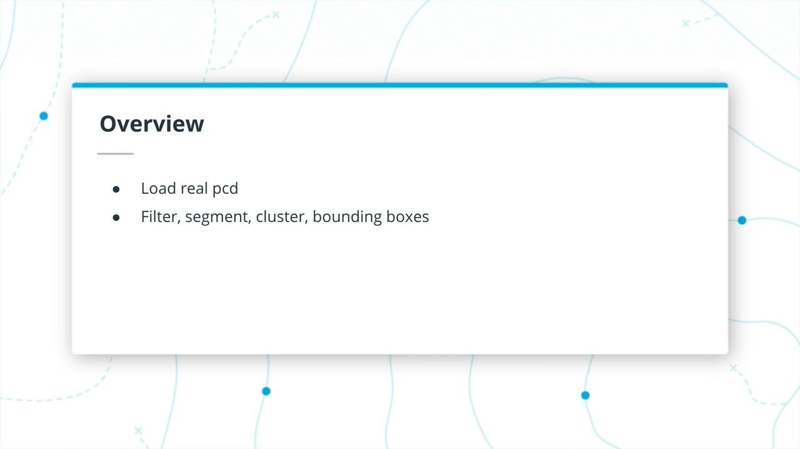

要首先加载汽车记录的pcd文件之一，您将需要创建一个新的点处理器，类似于我们之前在`simpleHighway`函数中创建的处理器。但是，这次您将使用pcl `PointXYZI`类型，“I”代表强度，它现在将成为云中每个点的附加功能。

在`environment.cpp`中，您应该创建一个名为`CityBlock`的新函数，该函数的布局将与`simpleHighway`函数相同。`CityBlock`的参数将与`simpleHighway`相同，即对pcl viewer的引用。

在新的`CityBlock`函数内部，您将使用`PointXYZI`模板参数创建一个新的点处理器。您将使用点处理器加载汽车的点云之一，然后使用`renderPointCloud`函数进行查看。不要忘记调用`cityBlock`而不是在`main`中调用`simpleHighway`。查看以下代码以供参考。

汽车的所有pcd文件都位于`src/sensors/data/pcd/data_1/`

```cc
void cityBlock(pcl::visualization::PCLVisualizer::Ptr& viewer)
{
  // ----------------------------------------------------
  // -----Open 3D viewer and display City Block     -----
  // ----------------------------------------------------

  ProcessPointClouds<pcl::PointXYZI>* pointProcessorI = new ProcessPointClouds<pcl::PointXYZI>();
  pcl::PointCloud<pcl::PointXYZI>::Ptr inputCloud = pointProcessorI->loadPcd("../src/sensors/data/pcd/data_1/0000000000.pcd");
  renderPointCloud(viewer,inputCloud,"inputCloud");
}
```
## Load PCD

下图是加载和运行的结果，如果未在`renderPointCloud`函数参数中指定颜色，则默认使用强度颜色编码。

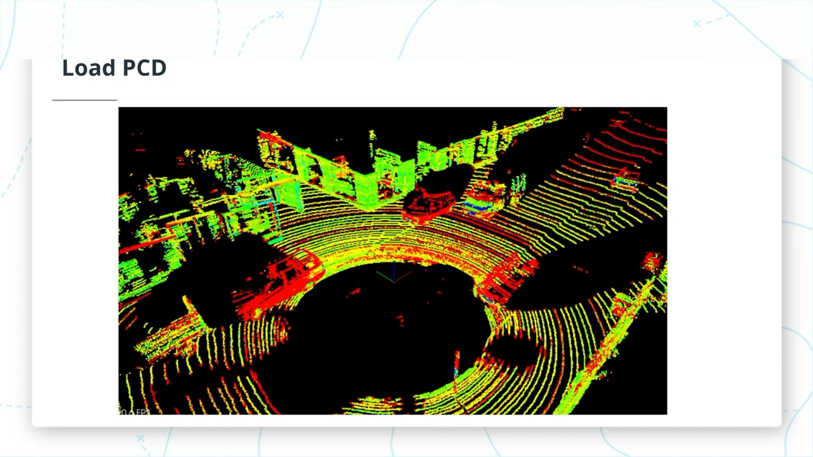

环顾PCD，您会看到几辆车停在路边，一辆卡车正驶过左侧的ego car。您的目标是在这些汽车和过往的卡车周围安装边界框，以便您的系统以后可以在路径规划器中使用该信息，从而避免与这些障碍物发生任何碰撞。

## Instructions

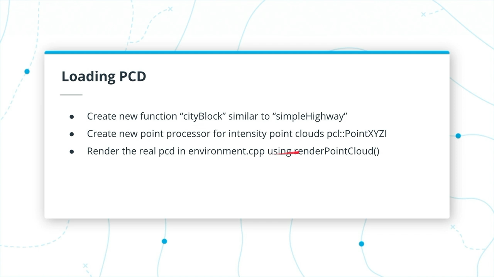

- 创建如上图所示的`cityBlock`函数
- 用`cityBlock`替换`main`中的`simpleHighway`
- 编译/运行，输出将类似于上面的图
- 绕着点云旋转缩放

## Solution

```diff
diff --git a/src/environment.cpp b/src/environment.cpp
index e9700a5..7ae1d01 100644
--- a/src/environment.cpp
+++ b/src/environment.cpp
@@ -76,6 +76,17 @@ void simpleHighway(pcl::visualization::PCLVisualizer::Ptr& viewer)
     }
 }

+void cityBlock(pcl::visualization::PCLVisualizer::Ptr& viewer)
+{
+  // ----------------------------------------------------
+  // -----Open 3D viewer and display City Block     -----
+  // ----------------------------------------------------
+
+    ProcessPointClouds<pcl::PointXYZI>* pointProcessorI = new ProcessPointClouds<pcl::PointXYZI>();
+    pcl::PointCloud<pcl::PointXYZI>::Ptr inputCloud = pointProcessorI->loadPcd("../src/sensors/data/pcd/data_1/0000000000.pcd");
+    renderPointCloud(viewer,inputCloud,"inputCloud");
+}
+
 //setAngle: SWITCH CAMERA ANGLE {XY, TopDown, Side, FPS}
 void initCamera(CameraAngle setAngle, pcl::visualization::PCLVisualizer::Ptr& viewer)
 {
@@ -107,7 +118,8 @@ int main (int argc, char** argv)
     pcl::visualization::PCLVisualizer::Ptr viewer (new pcl::visualization::PCLVisualizer ("3D Viewer"));
     CameraAngle setAngle = XY;
     initCamera(setAngle, viewer);
-    simpleHighway(viewer);
+    //simpleHighway(viewer);
+    cityBlock(viewer);

     while (!viewer->wasStopped ())
     {
```

# 3. Challenges with Real World Lidar

在现实世界中使用激光雷达出现的一些挑战来自环境条件。因此，激光雷达在大雨，尘土飞扬的地方效果不佳，空气中是否有大量尘土，都会发现沙尘暴。任何反射和散射激光雷达的东西，都会限制激光雷达的使用。您有时还会基于反射创建幻影对象。如果您的表面具有高反射性，则激光雷达光束会从该表面反射，撞击车辆，被反射回后表面并返回到激光雷达，您会创建幻影对象或没有人的对象； 真的没有任何对象。您会得到激光雷达的返回，例如从喷雾中获得的返回，我们在测试轨道上看到了返回。突然开始下大雨，然后我们有了所有奇怪的物体，而这仅仅是从其他汽车轮胎喷出的水。这就是您面临的困难。

# 4. Downsampling

通过车辆网络发送点云数据，需要下采样。就是把点云转换成stixels, 比如车尾，只需要记录高和宽就行，中间的点云可以不要

# 5. Filtering with PCL

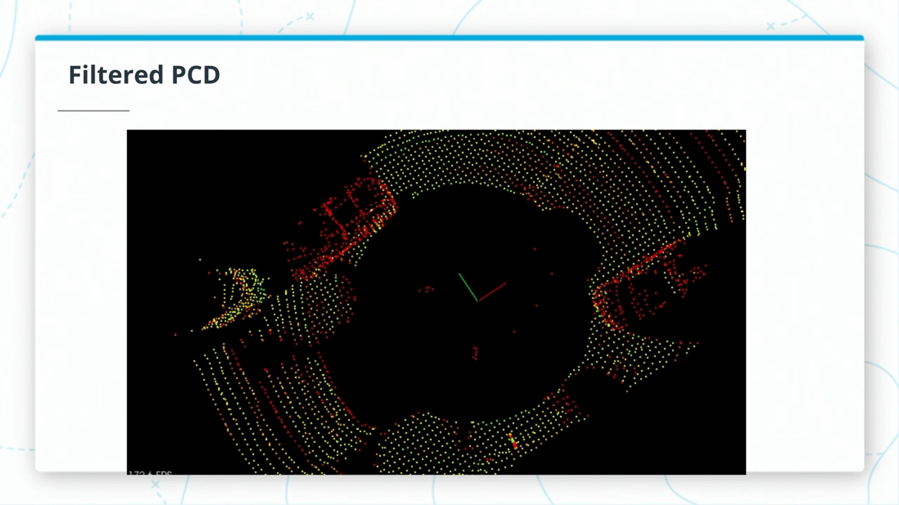

在查看以前的加载点云时，您可能会注意到的第一件事是它的分辨率很高，并且跨越的距离很远。您希望您的处理器管道能够尽快消化点云，因此您希望将云过滤​​掉。这里有用于执行此操作的两种方法。

## Voxel Grid

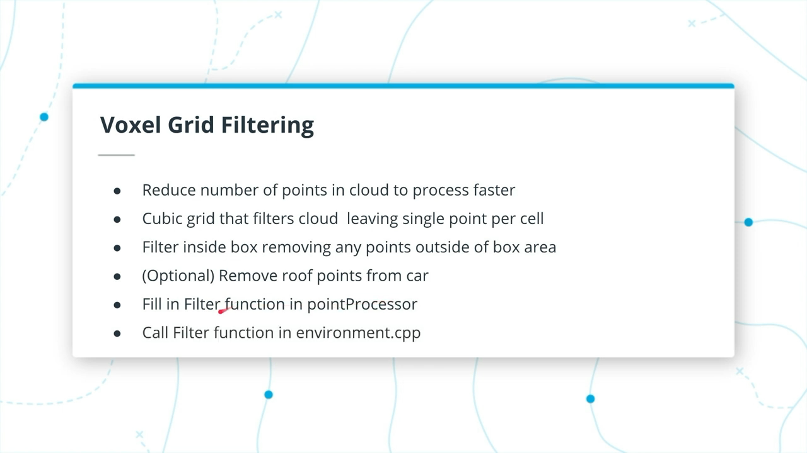

体素网格（Voxel grid）过滤将创建**立方网格**，并且将通过仅**在每个体素立方体**上**保留单个点**来过滤点云，因此，立方体长度越大，点云的分辨率越低。

## Region of Interest

定义了一个有框的区域，并删除了该框以外的所有点。

要应用这些方法，您将填写点处理函数`FilterCloud`。此函数的参数将是您的输入云，体素网格大小以及代表您感兴趣区域的最小/最大点。该函数将返回仅在指定区域内的点的降采样云。要开始使用，请查看PCL的文档以了解体素网格过滤([voxel grid filtering](http://pointclouds.org/documentation/tutorials/voxel_grid.php))和感兴趣区域([region of interest](http://docs.pointclouds.org/trunk/classpcl_1_1_crop_box.html))。

## Results

要应用过滤功能，请在`cityBlock`中调用pointProcessor 的`FilterCloud` 函数，使用加载的pcd做为参数。
```cc
// Experiment with the ? values and find what works best
filterCloud = pointProcessorI->FilterCloud(inputCloud, ? , Eigen::Vector4f (?, ?, ?, 1), Eigen::Vector4f ( ?, ?, ?, 1));
renderPointCloud(viewer,filterCloud,"filterCloud");
```

现在，在下面的过滤器云图像中，您可以看到点分辨率比原始分辨率低得多，并且裁剪了指定框点内的所有内容。实验并尝试使用过滤器输入的超级参数很重要。
- 体素大小应足够大以帮助加快处理速度，但又不能太大以至于对象定义完全丢失。
- 为了选择一个好的区域，请尝试在汽车前面留出足够的空间，以便它可以对遇到的任何障碍物及时做出快速反应。
- 另外，对于侧面，请尝试至少覆盖道路的宽度。最重要的是我们要检测的障碍物在该区域内。
- 还可以在`environment.cpp`设置相机角度，可以帮助您选择感兴趣的区域。这样，您可以轻松地将相机设置为具有自顶向下的概览或侧面的概览。
- 最后一件事是，删除撞到ego车顶的点将是有益的。您可以使用pcl `CropBox`查找屋顶点索引，然后将这些索引提供给pcl `ExtractIndices`对象以将其删除（类似于您的分割算法用于提取点的方法）。
- `renderBox`函数对于弄清楚场景中的box有多大也很有帮助。

## Filtered PCD
- 过滤后的PCD
  
  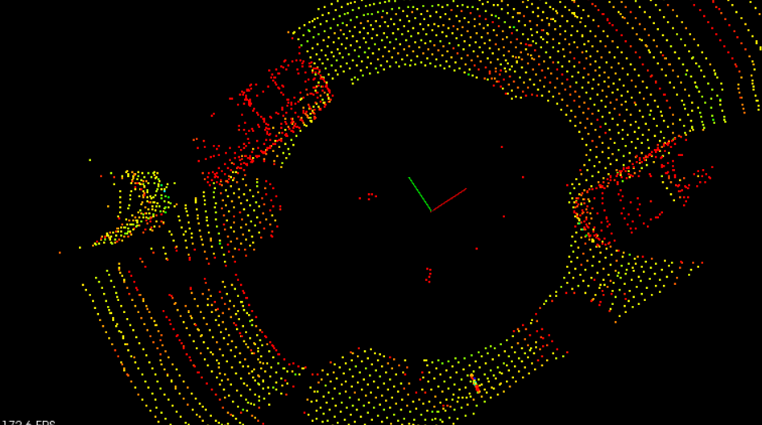

- 过滤前的PCD

  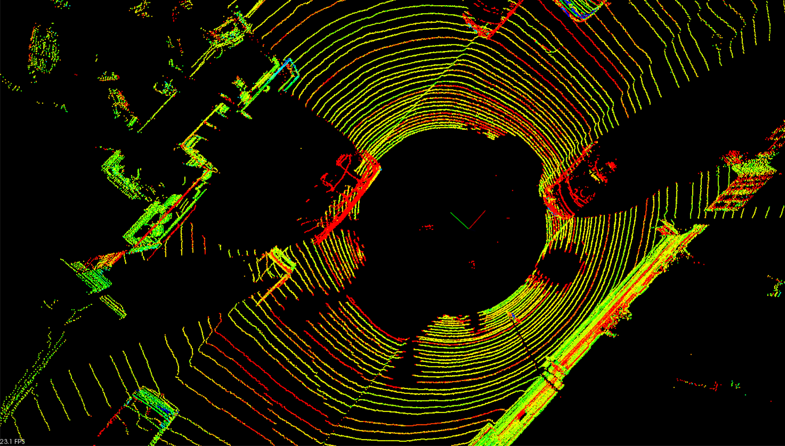

## Instructions
- 填写`pointProcessor`中的`FilterCloud`函数
- 从`cityBlock`调用`FilterCloud`并尝试使用超参数
- （可选）删除ego车顶点
- 观察结果

## Solution

```diff
diff --git a/src/environment.cpp b/src/environment.cpp
index 7ae1d01..f664533 100644
--- a/src/environment.cpp
+++ b/src/environment.cpp
@@ -84,7 +84,10 @@ void cityBlock(pcl::visualization::PCLVisualizer::Ptr& viewer)

     ProcessPointClouds<pcl::PointXYZI>* pointProcessorI = new ProcessPointClouds<pcl::PointXYZI>();
     pcl::PointCloud<pcl::PointXYZI>::Ptr inputCloud = pointProcessorI->loadPcd("../src/sensors/data/pcd/data_1/0000000000.pcd");
-    renderPointCloud(viewer,inputCloud,"inputCloud");
+    // renderPointCloud(viewer,inputCloud,"inputCloud");
+    // Experiment with the ? values and find what works best
+    pcl::PointCloud<pcl::PointXYZI>::Ptr filterCloud = pointProcessorI->FilterCloud(inputCloud, 0.2, Eigen::Vector4f (-12, -5, -2, 1), Eigen::Vector4f (12, 7, 2, 1));
+    renderPointCloud(viewer,filterCloud,"filterCloud");
 }

 //setAngle: SWITCH CAMERA ANGLE {XY, TopDown, Side, FPS}
diff --git a/src/processPointClouds.cpp b/src/processPointClouds.cpp
index 16d623c..ef14096 100644
--- a/src/processPointClouds.cpp
+++ b/src/processPointClouds.cpp
@@ -28,12 +28,45 @@ typename pcl::PointCloud<PointT>::Ptr ProcessPointClouds<PointT>::FilterCloud(ty
     auto startTime = std::chrono::steady_clock::now();

     // TODO:: Fill in the function to do voxel grid point reduction and region based filtering
+    // Create the filtering object
+    typename pcl::PointCloud<PointT>::Ptr cloud_filtered (new pcl::PointCloud<PointT>);
+
+    typename pcl::VoxelGrid<PointT> sor;
+    sor.setInputCloud (cloud);
+    sor.setLeafSize (filterRes, filterRes, filterRes);
+    sor.filter (*cloud_filtered);
+
+    typename pcl::PointCloud<PointT>::Ptr cloud_cropped (new pcl::PointCloud<PointT>);
+    typename pcl::CropBox<PointT> cropBox;
+    cropBox.setMin(minPoint);
+    cropBox.setMax(maxPoint);
+    cropBox.setInputCloud (cloud_filtered);
+    cropBox.filter(*cloud_cropped);
+
+    // optional remove ego car roof points
+    std::vector<int> indices;
+    pcl::CropBox<PointT> cropRoof;
+    cropRoof.setMin(Eigen::Vector4f(-1.5, -1.7, -1, 1));
+    cropRoof.setMax(Eigen::Vector4f(2.6, 1.7, -0.4, 1));
+    cropRoof.setInputCloud (cloud_cropped);
+    cropRoof.filter(indices);
+
+    pcl::PointIndices::Ptr inliers { new pcl::PointIndices };
+    for (int point : indices) {
+        inliers->indices.push_back(point);
+    }
+
+    pcl::ExtractIndices<PointT> extract;
+    extract.setInputCloud(cloud_cropped);
+    extract.setIndices(inliers);
+    extract.setNegative(true);
+    extract.filter(*cloud_cropped);

     auto endTime = std::chrono::steady_clock::now();
     auto elapsedTime = std::chrono::duration_cast<std::chrono::milliseconds>(endTime - startTime);
     std::cout << "filtering took " << elapsedTime.count() << " milliseconds" << std::endl;

-    return cloud;
+    return cloud_cropped;

 }
```
# 6. Steps For Obstacle Detection

## Overview of Detection Pipeline

现在已经对pcd进行了过滤，您可以使用先前在上一课中应用的相同的分割和聚类技术，现在使用`cityBlock`中的新的强度点处理器。

## Step 1. Segment the filtered cloud into two parts, road and obstacles.

过滤点云后，下一步是对其进行分割。下图显示了已过滤的点云，分段（绿色是道路）（红色是障碍物），仅在过滤的感兴趣区域中有点。该图像还显示一个紫色框，其中显示了包含并移除汽车车顶点的空间。

### Segmented PCD

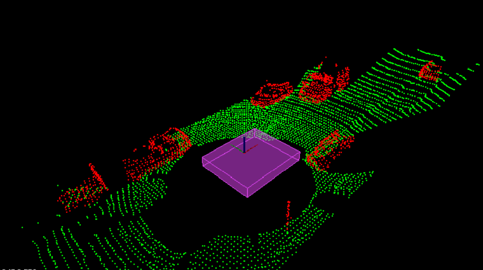
> Segmented point clouds. The purple box shows where ego car roof point were removed.

### Solution
```diff
diff --git a/src/environment.cpp b/src/environment.cpp
index f664533..ebeb1ee 100644
--- a/src/environment.cpp
+++ b/src/environment.cpp
@@ -85,9 +85,18 @@ void cityBlock(pcl::visualization::PCLVisualizer::Ptr& viewer)
     ProcessPointClouds<pcl::PointXYZI>* pointProcessorI = new ProcessPointClouds<pcl::PointXYZI>();
     pcl::PointCloud<pcl::PointXYZI>::Ptr inputCloud = pointProcessorI->loadPcd("../src/sensors/data/pcd/data_1/0000000000.pcd");
     // renderPointCloud(viewer,inputCloud,"inputCloud");
+
+    // Filter
     // Experiment with the ? values and find what works best
-    pcl::PointCloud<pcl::PointXYZI>::Ptr filterCloud = pointProcessorI->FilterCloud(inputCloud, 0.2, Eigen::Vector4f (-12, -5, -2, 1), Eigen::Vector4f (12, 7, 2, 1));
+    pcl::PointCloud<pcl::PointXYZI>::Ptr filterCloud = pointProcessorI->FilterCloud(inputCloud, 0.2, Eigen::Vector4f (-12, -5, -2, 1), Eigen::Vector4f (22, 7, 2, 1));
     renderPointCloud(viewer,filterCloud,"filterCloud");
+
+    // Segment
+    std::pair<pcl::PointCloud<pcl::PointXYZI>::Ptr, pcl::PointCloud<pcl::PointXYZI>::Ptr> segmentCloud = pointProcessorI->SegmentPlane(filterCloud, 100, 0.2);
+    renderPointCloud(viewer,segmentCloud.first,"obstCloud",Color(1,0,0));
+    renderPointCloud(viewer,segmentCloud.second,"planeCloud",Color(0,1,0));
+    Box box = {-2.0f, -2.0f, -1.0f, 2.0f, 2.0f, 0.0f};
+    renderBox(viewer, box, 0, Color(1, 0, 1), 1.0f);
 }
```

## Step 2. Cluster the obstacle cloud.

接下来，您将基于相邻点的接近性对障碍云进行聚类。下图以红色，黄色和蓝色的循环颜色显示了聚类。在该图像中，我们看到迎面而来的卡车实际上分为正面和背面两种颜色。这说明了基于接近度进行聚类的挑战，卡车前部和卡车后部之间的间隙足够大，以至于它们看起来分开。您可能会想通过增加距离公差来解决此问题，但是您也可以看到卡车实际上已经接近一侧停放的汽车。增加距离公差会冒着将卡车和停放的汽车组合在一起的风险。

### Clustering PCD

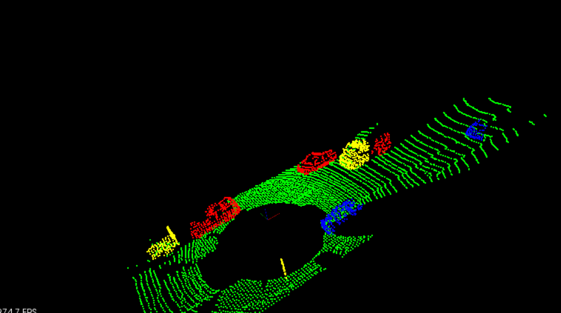
> Clustering the point cloud. Different cluster shown in cycled colors, red, yellow, and blue.

### Solution
```diff
diff --git a/src/environment.cpp b/src/environment.cpp
index ebeb1ee..ee527d4 100644
--- a/src/environment.cpp
+++ b/src/environment.cpp
@@ -93,10 +93,23 @@ void cityBlock(pcl::visualization::PCLVisualizer::Ptr& viewer)

     // Segment
     std::pair<pcl::PointCloud<pcl::PointXYZI>::Ptr, pcl::PointCloud<pcl::PointXYZI>::Ptr> segmentCloud = pointProcessorI->SegmentPlane(filterCloud, 100, 0.2);
-    renderPointCloud(viewer,segmentCloud.first,"obstCloud",Color(1,0,0));
+    renderPointCloud(viewer,segmentCloud.first,"obstCloud",Color(1,1,1));
     renderPointCloud(viewer,segmentCloud.second,"planeCloud",Color(0,1,0));
     Box box = {-2.0f, -2.0f, -1.0f, 2.0f, 2.0f, 0.0f};
     renderBox(viewer, box, 0, Color(1, 0, 1), 1.0f);
+
+    std::vector<pcl::PointCloud<pcl::PointXYZI>::Ptr> cloudClusters = pointProcessorI->Clustering(segmentCloud.first, 0.5, 10, 800);
+
+    int clusterId = 0;
+    std::vector<Color> colors = {Color(1,1,0), Color(0,1,1), Color(1,0,1), Color(0,0,1), Color(0,0.5,0.5), Color(0.2,0.5,1)};
+
+    for(pcl::PointCloud<pcl::PointXYZI>::Ptr cluster : cloudClusters)
+    {
+        std::cout << "cluster size ";
+        pointProcessorI->numPoints(cluster);
+        renderPointCloud(viewer, cluster,"obstCloud"+std::to_string(clusterId),colors[clusterId%6]);
+        ++clusterId;
+    }
 }

 //setAngle: SWITCH CAMERA ANGLE {XY, TopDown, Side, FPS}
diff --git a/src/processPointClouds.cpp b/src/processPointClouds.cpp
index ef14096..5cfceaa 100644
--- a/src/processPointClouds.cpp
+++ b/src/processPointClouds.cpp
@@ -151,7 +151,7 @@ std::vector<typename pcl::PointCloud<PointT>::Ptr> ProcessPointClouds<PointT>::C
     ec.extract (cluster_indices);

     for (std::vector<pcl::PointIndices>::const_iterator it = cluster_indices.begin (); it != cluster_indices.end (); ++it) {
-        typename pcl::PointCloud<PointT>::Ptr cloud_cluster (new pcl::PointCloud<pcl::PointXYZ>);
+        typename pcl::PointCloud<PointT>::Ptr cloud_cluster (new pcl::PointCloud<PointT>);
         for (std::vector<int>::const_iterator pit = it->indices.begin (); pit != it->indices.end (); ++pit)
             cloud_cluster->points.push_back (cloud->points[*pit]);
         cloud_cluster->width = cloud_cluster->points.size ();
```
## Step 3. Find bounding boxes for the clusters

最后，将包围box放置在各个聚类周围。由于此场景中所有可检测到的车辆都与我们的车辆位于同一轴线上，因此在点处理器中简单设置的边界框功能应该会产生良好的效果。

### Bounding Box PCD

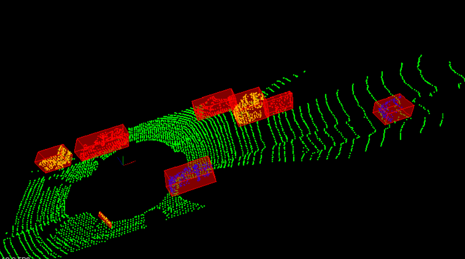
> Bounding boxes around cluster obstacles.

太棒了！ 祝贺您在真实的pcd文件上通过点处理管道完成了它。对单个帧的结果满意后，让我们看一下处理帧流的过程。

### Solution
```diff
diff --git a/src/environment.cpp b/src/environment.cpp
index ee527d4..a98e591 100644
--- a/src/environment.cpp
+++ b/src/environment.cpp
@@ -88,17 +88,17 @@ void cityBlock(pcl::visualization::PCLVisualizer::Ptr& viewer)

     // Filter
     // Experiment with the ? values and find what works best
-    pcl::PointCloud<pcl::PointXYZI>::Ptr filterCloud = pointProcessorI->FilterCloud(inputCloud, 0.2, Eigen::Vector4f (-12, -5, -2, 1), Eigen::Vector4f (22, 7, 2, 1));
+    pcl::PointCloud<pcl::PointXYZI>::Ptr filterCloud = pointProcessorI->FilterCloud(inputCloud, 0.2, Eigen::Vector4f (-12, -5, -2, 1), Eigen::Vector4f (22, 6.5, 2, 1));
     renderPointCloud(viewer,filterCloud,"filterCloud");
 
     // Segment
     std::pair<pcl::PointCloud<pcl::PointXYZI>::Ptr, pcl::PointCloud<pcl::PointXYZI>::Ptr> segmentCloud = pointProcessorI->SegmentPlane(filterCloud, 100, 0.2);
-    renderPointCloud(viewer,segmentCloud.first,"obstCloud",Color(1,1,1));
+    // renderPointCloud(viewer,segmentCloud.first,"obstCloud",Color(1,1,1));
     renderPointCloud(viewer,segmentCloud.second,"planeCloud",Color(0,1,0));
     Box box = {-2.0f, -2.0f, -1.0f, 2.0f, 2.0f, 0.0f};
-    renderBox(viewer, box, 0, Color(1, 0, 1), 1.0f);
+    // renderBox(viewer, box, 0, Color(1, 0, 1), 1.0f);

-    std::vector<pcl::PointCloud<pcl::PointXYZI>::Ptr> cloudClusters = pointProcessorI->Clustering(segmentCloud.first, 0.5, 10, 800);
+    std::vector<pcl::PointCloud<pcl::PointXYZI>::Ptr> cloudClusters = pointProcessorI->Clustering(segmentCloud.first, 0.4, 10, 1000);
 
     int clusterId = 0;
     std::vector<Color> colors = {Color(1,1,0), Color(0,1,1), Color(1,0,1), Color(0,0,1), Color(0,0.5,0.5), Color(0.2,0.5,1)};
@@ -108,6 +108,10 @@ void cityBlock(pcl::visualization::PCLVisualizer::Ptr& viewer)
         std::cout << "cluster size ";
         pointProcessorI->numPoints(cluster);
         renderPointCloud(viewer, cluster,"obstCloud"+std::to_string(clusterId),colors[clusterId%6]);
+
+        // Bounding Box PCD
+        Box box = pointProcessorI->BoundingBox(cluster);
+        renderBox(viewer,box,clusterId);
         ++clusterId;
     }
 }
```

# 7. Stream PCD


> Playing back the pcd files.

## Stream PCD with PCL

在先前的概念中，您能够在单个pcd文件上处理障碍物检测，现在您将在多个pcd文件上使用相同的处理管道。为此，您可以从`environment.cpp`中稍微修改先前使用的`cityBlock`函数，以支持一些其他参数。现在，您将把点处理器传递给`cityBlock`函数，这是因为您不想在每一帧都重新创建该对象。同样，点云输入将随帧而变化，因此输入点云现在将成为`cityBlock`的输入参数。现在，`cityBlock`函数头应如下所示，您不再创建点处理器或从函数内部加载点云。

## cityBlock new Function Signature
```cc
void cityBlock(pcl::visualization::PCLVisualizer::Ptr& viewer, ProcessPointClouds<pcl::PointXYZI>* pointProcessorI, const pcl::PointCloud<pcl::PointXYZI>::Ptr& inputCloud)
```

注意，在函数头中，您可以选择在变量定义的末尾通过`const`和`&`来使`inputCloud`成为常量引用。您不必执行此操作，但实际上根本没有更改`inputCloud`，只是将其用作点处理器函数的输入。使用常量引用的好处是可以提高内存效率，因为您不必写入该变量的内存，而只需从其读取即可，因此性能略有提高。如果确实将其设为`const`引用，请确保不要对其进行修改，否则会出现编译错误。

## Code inside main

因此，现在，您无需创建点处理器和从`cityBlock`内部加载`pcl`文件，而只需在设置pcl查看器相机位置之后，在`environment.cpp`的`main`函数中执行此操作。

```cc
ProcessPointClouds<pcl::PointXYZI>* pointProcessorI = new ProcessPointClouds<pcl::PointXYZI>();
std::vector<boost::filesystem::path> stream = pointProcessorI->streamPcd("../src/sensors/data/pcd/data_1");
auto streamIterator = stream.begin();
pcl::PointCloud<pcl::PointXYZI>::Ptr inputCloudI;
```

在上面的代码中，您正在使用一种来自点处理器的新方法`streamPcd`。您告诉`streamPcd`一个文件夹目录，其中包含要处理的所有按顺序排序的pcd文件，它返回按时间顺序排列的所有这些文件名的向量，称为`stream`。 然后，您可以通过两种方式浏览`stream`，一种选择是使用迭代器。在以上代码块的末尾，还为输入点云设置了变量。

## PCL Viewer Update Loop

最后要看的是pcl查看器的运行周期，它位于`envrionment.cpp`的底部。当pcl查看器没有停止时，您想要处理一个新的帧，对其进行障碍检测，然后查看结果。让我们看看下面如何设置此pcl查看器运行周期方法。

```cc
while (!viewer->wasStopped ())
{

  // Clear viewer
  viewer->removeAllPointClouds();
  viewer->removeAllShapes();

  // Load pcd and run obstacle detection process
  inputCloudI = pointProcessorI->loadPcd((*streamIterator).string());
  cityBlock(viewer, pointProcessorI, inputCloudI);

  streamIterator++;
  if(streamIterator == stream.end())
    streamIterator = stream.begin();

  viewer->spinOnce ();
}
```

上面方法的第一件事是清除任何以前渲染的点云或形状。接下来，它使用点处理器和流迭代器加载点云。然后，它调用您的`cityBlock`函数，并更新迭代器。如果迭代器到达向量的末尾，则只需将其设置回开始就可以了。`viewer->spinOnce()`调用控制帧速率，默认情况下它等待1个时间步长，这将使其尽可能快地运行。视您的障碍物检测功能设置的时间效率而定，观看者的帧频将更快。如果要以最快的速度签出输入的pcd数据，请运行上面的代码，仅在`cityBlock`内的输入云上运行单个`renderPointCloud`。让我们在下面查看流式pcd查看器的结果。

## Streamed Obstacle Detection

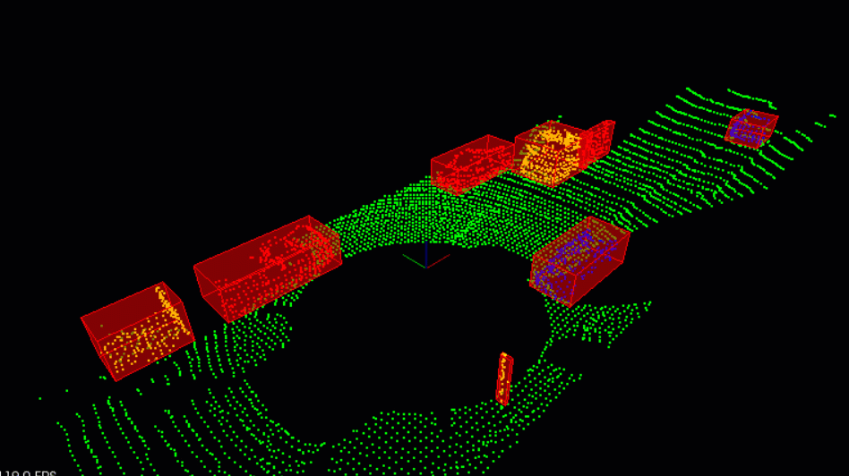

## Instructions
- 使用上述更改修改`environment.cpp`
- 调用`cityBlock`对每一帧进行障碍物检测

## Solution
```diff
diff --git a/src/environment.cpp b/src/environment.cpp
index a98e591..7d58f35 100644
--- a/src/environment.cpp
+++ b/src/environment.cpp
@@ -76,14 +76,15 @@ void simpleHighway(pcl::visualization::PCLVisualizer::Ptr& viewer)
     }
 }

-void cityBlock(pcl::visualization::PCLVisualizer::Ptr& viewer)
+// void cityBlock(pcl::visualization::PCLVisualizer::Ptr& viewer)
+void cityBlock(pcl::visualization::PCLVisualizer::Ptr& viewer, ProcessPointClouds<pcl::PointXYZI>* pointProcessorI, const pcl::PointCloud<pcl::PointXYZI>::Ptr& inputCloud)
 {
   // ----------------------------------------------------
   // -----Open 3D viewer and display City Block     -----
   // ----------------------------------------------------

-    ProcessPointClouds<pcl::PointXYZI>* pointProcessorI = new ProcessPointClouds<pcl::PointXYZI>();
-    pcl::PointCloud<pcl::PointXYZI>::Ptr inputCloud = pointProcessorI->loadPcd("../src/sensors/data/pcd/data_1/0000000000.pcd");
+    // ProcessPointClouds<pcl::PointXYZI>* pointProcessorI = new ProcessPointClouds<pcl::PointXYZI>();
+    // pcl::PointCloud<pcl::PointXYZI>::Ptr inputCloud = pointProcessorI->loadPcd("../src/sensors/data/pcd/data_1/0000000000.pcd");
     // renderPointCloud(viewer,inputCloud,"inputCloud");

     // Filter
@@ -148,10 +149,26 @@ int main (int argc, char** argv)
     CameraAngle setAngle = XY;
     initCamera(setAngle, viewer);
     //simpleHighway(viewer);
-    cityBlock(viewer);
+    // cityBlock(viewer);
+
+    ProcessPointClouds<pcl::PointXYZI>* pointProcessorI = new ProcessPointClouds<pcl::PointXYZI>();
+    std::vector<boost::filesystem::path> stream = pointProcessorI->streamPcd("../src/sensors/data/pcd/data_1");
+    auto streamIterator = stream.begin();
+    pcl::PointCloud<pcl::PointXYZI>::Ptr inputCloudI;

     while (!viewer->wasStopped ())
     {
+        // Clear viewer
+        viewer->removeAllPointClouds();
+        viewer->removeAllShapes();
+
+        // Load pcd and run obstacle detection process
+        inputCloudI = pointProcessorI->loadPcd((*streamIterator).string());
+        cityBlock(viewer, pointProcessorI, inputCloudI);
+
+        streamIterator++;
+        if(streamIterator == stream.end())
+            streamIterator = stream.begin();
         viewer->spinOnce ();
     }
 }
```
# 8. Lidar Obstacle Detection Project

## Project Details

在这个项目中，您将学到的所有知识用于处理点云，并使用它在狭窄的街道上使用激光雷达检测汽车和卡车。检测管道应遵循涵盖的方法，过滤，分割，聚类和边界框。此外，分割和聚类方法也应使用上一课的指南从头开始创建，以供参考。完成的结果将如下图所示，将包围box放置在道路上的所有障碍物周围。


> Lidar Obstacle Detection.

# 9. Tracking and Challenge Problem

## Discussion on Tracking

您已经完成了整个激光雷达障碍物检测过程。您可以stream多个pcd文件并执行过滤，分割，聚类和边界框检测。既然您已经能够检测单个帧中的障碍物，则可以通过跟踪对帧历史的检测来使您的管道更具有鲁棒性。您可以在帧中的检测之间创建关联，并使用该关联来跟踪对象。

在两个不同帧之间创建关联的一种方法是**通过两次检测彼此之间的接近程度**以及它们的外观如何。您还可以探索更多的过滤流程，例如在考虑连续帧中看到的检测之前，先进行检测。 您还可以根据边界框，其体积和形状进行过滤。通过部署跟踪方法和关联，您可以**尝试动态构建障碍物的形状**。例如，也许您看到一辆长卡车的后部，而激光雷达只能首先看到卡车的后部。然后，您驶过卡车。让激光雷达看到卡车的侧面。有很多方法可以继续探索并使检测过程更强大。

## Challenge set


> Challenge problem: Track a bicyclist riding in front of the car.

## Challenge Problem

如果您要面对其他挑战，请查看`src/sensors/data/pcd/data_2`，以了解如何很好地检测/跟踪骑在车前的自行车手，以及检测/跟踪场景中其他周围的障碍物。
