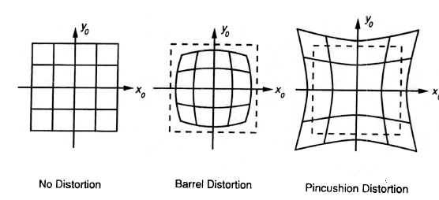
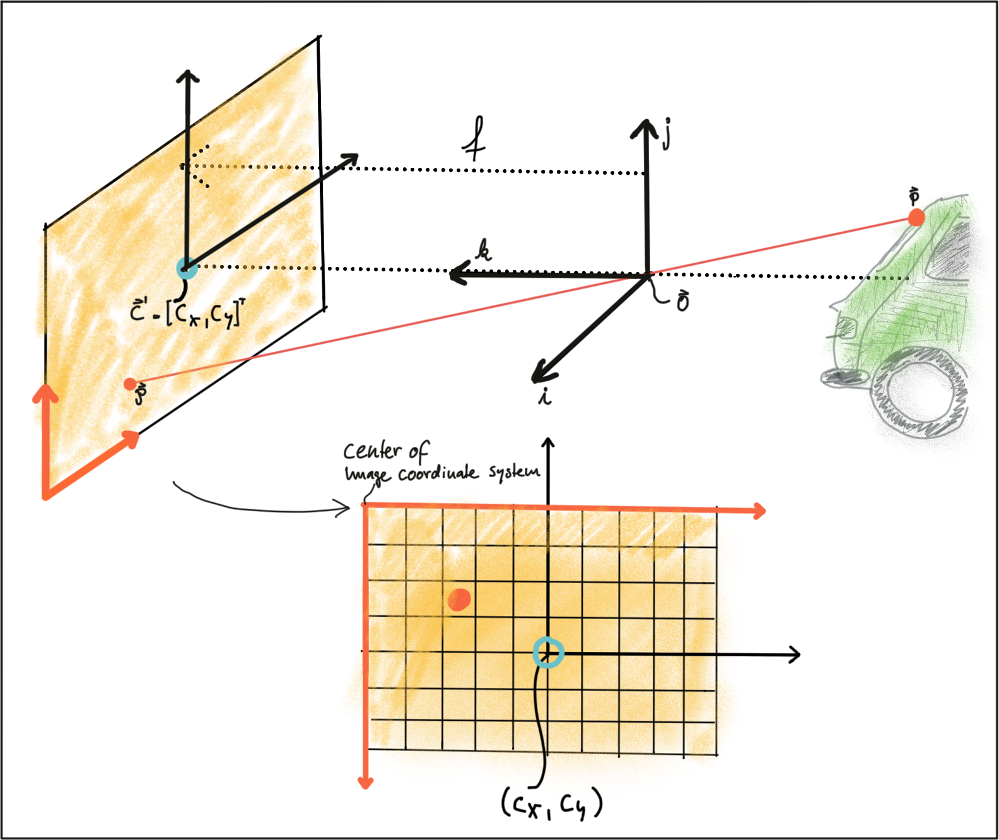
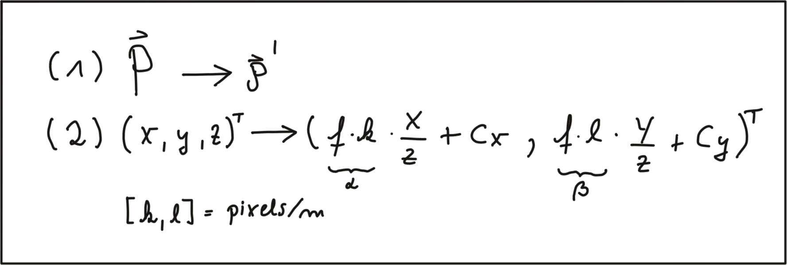

# 1. Levels of Autonomous Driving

根据CB Insights的数据，截至2019年4月，目前有46家公司在从事自动驾驶汽车业务。 这不仅包括奥迪，特斯拉，宝马，沃尔沃或通用汽车等汽车制造商，还包括来自Alphabet/Waymo，Uber或百度等汽车领域的新成员，它们来自完全不同的行业。

根据联合市场研究公司的估计，预计自动驾驶汽车市场将从2019年的540亿美元增长到2026年的5560亿美元。 如此高的增长率，再加上近年来的技术突破，可以解释为什么事情发展如此之快，以及为什么每个人都试图在这个新兴市场中占有一席之地。

除自动驾驶汽车外，还有一些系统可以在各种驾驶任务中为驾驶员提供帮助，例如改变车道，记住速度标志或及时制动，以防前车突然减速。这种系统被称为高级驾驶员辅助系统（ADAS），它们是全自动驾驶汽车的前身。但是，市场上有一些车辆暗示完全自治（例如Tesla Autopilot），但“仅仅是” ADAS系统。

在我们分析选择的自动驾驶汽车原型及其各自的传感器之前，让我们看一下定义自动驾驶的方法-因为并非所有自动驾驶汽车和驾驶员辅助系统都是一样的。 下图显示了自动工程师协会（SAE）定义的“自动驾驶级别”。

## The SAE Levels of Autonomous Driving


https://www.nhtsa.gov/technology-innovation/automated-vehicles-safety

多年来，ADAS产品（例如前向碰撞警告（FCW）或自适应巡航控制（ACC））是唯一在选定数量的驾驶情况下（例如在高速公路上，在城市中低速行驶）提供至少一定程度自动化的系统 。

特斯拉（Tesla）是全球首批向市场推出可自动驾驶的系统的公司之一，该系统具有高度的自治性。 但是，在SAE图表上，该系统“仅”在第2级，这意味着**驾驶员必须保持在线状态并应始终监控环境**。

级别3的步伐很大，因为**不再需要驾驶员监视环境**，即使驾驶员必须始终能够收回控制权。从法律的角度来看，这意味着**驾驶任务的责任在于汽车，因此是制造商**。这就是为什么我们还没有看到大量带有3级系统的商用车辆。一些制造商已经宣布了这样的系统，但是在撰写本文时（2019年5月），我们在市场上找不到它们。 其原因有三点：
1. 此类系统必须足够**可靠地构建**，以最大程度地减少错误决策的次数。工程师通常通过在汽车上添加大量传感器来解决此问题，这使得此类系统（非常）**昂贵**。
2. 担心因事故引起的诉讼诉讼会故意降低系统的可用性，例如通过**限制行驶速度或场景**（例如，仅在速度低于60kph的高速公路上，并且有清晰可见的车道标志的交通拥堵时）。
3. 不能始终保证驾驶员准备好控制车辆。在许多情况下，由于人类的反应时间和警觉水平，这是不可能的。

因此，许多专家认为，第3级系统只是过渡到在第4级和第5级上运行的更高级系统的过渡步骤。在这些级别上，车辆能够执行所有驾驶任务，而“驾驶员”不需要接管。 显然，这样的系统将需要大量的工程工作来始终保证驾驶员和道路使用者的安全。

在下一部分中，我们将详细介绍部分自动驾驶汽车及其相应的传感器套件。但是现在，您应该尝试通过回答以下测验问题来测试您的知识。

# 2. Autonomous Vehicle Sensor Sets

在上一节中，您了解了自动驾驶的不同级别，以及从第2级到第3级甚至更高级别所经历的飞跃。现在，显而易见的是，实现4级和5级自主性的**关键是传感器和感知算法的智能组合**，可随时监控车辆环境，以确保对所有交通事件做出适当和安全的反应。

为了让您了解在实践中如何解决此问题，本节简要概述了一些旨在实现4级甚至5级驾驶的车辆。由于本课程主要涉及相机和计算机视觉，并且在较小程度上也涉及激光雷达，因此让我们**主要关注这两种传感器类型**。现在让我们看看一些自动驾驶汽车及其各自的传感器套件。

## The Uber ATG Autonomous Vehicle

当前版本的Uber自动驾驶汽车将顶**部安装的360°激光雷达扫描仪与围绕汽车圆周放置的多个摄像头和雷达传感器**结合在一起。


让我们一一看一下这些传感器类别：
1. **摄像头**：经过改装的沃尔沃XC90 SUV的优步车队在**车顶上配备了一系列摄像头**，另外还有指向**车侧面和后方的摄像头**。车顶摄像头既可以**聚焦近场也可以聚焦远方，可以观察制动车辆，横穿行人，交通信号灯和标牌**。摄像头将其素材馈送到中央车载计算机，该计算机还接收其他传感器的信号，以创建车辆周围环境的精确图像。就像人的眼睛一样，**摄像头系统在夜间的性能会大大降低**，这使得它们在以所需的检测率和位置精度进行定位时不太可靠。这就是为什么Uber车队**配备了两种其他传感器类型的原因**。
2. **雷达**：雷达系统发出的无线电波会被（许多但不是全部）物体反射。可以**根据运行时间（给出距离）以及移动频率（给出相对速度）来分析返回波**。后者的特性清楚地将雷达与其他两种传感器类型区分开来，因为它是**唯一能够直接测量物体速度的传感器**。而且，雷达在恶劣的天气条件下（例如大雪和浓雾）鲁棒性很高。雷达由巡航控制系统使用多年，在识别具有良好反射特性的较大物体时效果最好。**当检测反射特性降低的较小或“软”物体（人，动物）时，雷达检测性能会下降**。即使摄像头和雷达结合得很好，在某些情况下两个传感器也无法最佳工作-这就是为什么Uber选择将第三个传感器投入使用的原因。
3. **激光雷达**：激光雷达的工作方式与雷达类似，但它不发射无线电波，而是使用红外光。车顶式传感器高速旋转并构建其周围环境的详细3D图像。对于Velodyne VLS-128，总共使用128束激光束来检测长达300米的障碍物。 在单次旋转360度的过程中，每秒总共产生多达400万个数据点。与相机类似，激光雷达是一种光学传感器。然而，它**具有“自带光源”的显着优势，而相机依赖于环境光和车辆前灯**，但是必须指出，**在不利的环境条件下，如雪，大雨，激光雷达的性能也会降低**。再加上某些材料的低反射特性，激光雷达可能无法为交通中的某些物体生成足够密集的点云，而仅留下几个3D点可用于工作，因此将激光雷达结合起来是一个好主意 与其他传感器配合使用，以确保检测性能足够高，可用于通过交通的自主导航。

下图显示了由Uber自动驾驶汽车生成的激光雷达3D点云，以及前置摄像头的图像（作为左上角的覆盖图）。重建场景的总体印象是非常积极的。但是，如果仔细观察，您会发现场景中对象之间的激光雷达点数变化很大。


## Mercedes Benz Autonomous Prototype

目前，德国汽车制造商梅赛德斯·奔驰（Mercedes Benz）正在开发一种自动驾驶汽车原型，该原型车配备了类似于Uber的摄像头，激光雷达和雷达传感器。梅赛德斯使用多个摄像头扫描车辆周围的区域。特别令人关注的是一个由两个**同步摄像机组成的立体装置**，该摄像机能够通过在两个图像中找到相应的特征来**测量深度**。下图显示了系统使用的整个摄像机主机。梅赛德斯表示，仅立体摄像机就可为每行驶1公里产生总计100 GB的数据。


https://www.mercedes-benz.com/en/mercedes-benz/innovation/successful-autonomous-driving-a-pilot-project-by-daimler-and-bosch/


我认为立体摄像机绝对有用，但是它确实取决于整体传感器配置或汽车上的其他传感器。
- 如果考虑从立体摄像机进行**深度估计**，则与任何其他传感器相比，深度图的密度确实很高，并且在近场中的精度也很高。如果您想要一个便宜的，高分辨率的深度传感器，那么远场和成本方面是一个问题，尤其是立体摄像机。
- 如果使用**单摄像机**将立体与运动的结构进行比较，则基本上可以选择，如果只有单个摄像机，则可以**根据自己的运动来重建3D环境，也可以使用静态环境中的特征来估算自己的运动** 。 这就是**视觉测距部分**。
  - 但是，一旦您在场景中有了动态对象并且也要移动自己，那么您就**无法再真正估计其他交通参与者的距离和速度了**。 您**只能使用立体相机**，我认为这就是为什么它仍然非常有价值的原因。
  - 但这实际上取决于您在车辆上还具有多少个其他传感器。如果您拥有可以更加精确地测量距离并更加精确地测量速度的LiDAR和RADAR，我认为立体相机的好处正在减少。虽然它仍然是冗余的。

## The Tesla Autopilot

当Autopilot系统首次出售时，它基本上是自适应巡航控制系统和换道辅助系统的组合-长期以来，全球其他制造商都可以使用这套功能。但是，“Autopilot”这个名称暗示着这辆汽车将是真正的自动驾驶。实际上，许多特斯拉车主确实通过在系统驱动下爬上后座，看书或小睡来对系统进行极限测试。但是，在SAE级别上，自动驾驶仪“仅”分类为2级，即**驾驶员始终负责驾驶任务**。

2016年10月，特斯拉Model S和X传感器组进行了重大升级，并通过定期机载软件更新扩展了Autopilot的功能。

该图显示了特斯拉的内部，摄像机视图叠加在右侧。该图显示了左右后置摄像头以及用于中等距离感知的前置摄像头。


从概述中可以看出，该系统将多个具有部分重叠视场的相机传感器与一个前向雷达传感器结合在一起。
 


https://www.tesla.cn/autopilot?redirect=no

让我们依次查看每种传感器类型：
- 摄像头：前向光学阵列由**四个焦距不同的摄像头组成**。narrow-forward camera可以捕捉到前方250m的镜头，开口角度稍大的forward camera可以捕捉到前方150m的距离，wide-angle camera可以捕捉到前方60m的图像，以及一组forward-looking side cameras捕捉汽车前方和侧面80m的镜头。 wide-angle camera旨在读取路标和交通信号灯，使汽车能够做出相应的反应。但是，是否可以在交通中可靠使用此功能一直存在争议。
- 雷达：forward-looking radar可以看到汽车前方160m。特斯拉创始人埃隆·马斯克（Elon Musk）表示，它能够透过“沙，雪，雾-几乎任何东西”。
- 声纳：360° ultrasonic sonar可探测汽车周围八米半径内的障碍物。超声波传感器可以任何速度工作，用于在汽车附近发现物体。超声波传感器还可以在自动切换车道时用于辅助汽车。但是，与该系列的其他传感器相比，它们的作用范围受到很大限制，并且终止于约8米的距离。


您可能已经注意到，特斯拉计划使用此设置提供4级甚至5级自动驾驶，但并未使用激光雷达传感器。与Uber，Waymo和其他几家致力于完全自主的制造商不同，特斯拉坚信，一套高性能相机和强大的雷达传感器将足以满足4级/5级自治的需要。在撰写本文时，关于自动驾驶汽车的最佳传感器组的争论一直很激烈。特斯拉认为，激光雷达的价格和包装劣势将使自动驾驶仪对客户没有吸引力。通用汽车公司的自动驾驶汽车集成总监斯科特·米勒（Scott Miller）等严厉的批评家不同意并认为自动驾驶汽车的安全性要求很高，仅靠摄像头和雷达无法满足这些要求。

必须注意的是，在所有传感器设置中，无论是Uber，Tesla，Waymo还是梅赛德斯或奥迪等传统制造商，都始终使用摄像头。即使关于雷达或激光雷达的辩论仍在进行中，还是将两者结合使用是最佳选择，但相机从未受到质疑。因此，了解相机和计算机视觉是一个好主意，我们将在本课程中对此进行详细介绍。

## Sensor Selection Criteria

自主或配备ADAS的车辆的设计涉及选择合适的传感器组。正如您在上一节中所了解的那样，正在讨论要完全（甚至部分）自治需要哪些传感器组合。在本节中，您将了解传感器选择标准，以及相机，激光雷达和雷达在每种标准方面的差异。

下面，简要讨论最典型的选择标准。
1. 范围(Range)：
   - 激光雷达和雷达系统可以检测到几米到200m以上距离的物体。许多激光雷达系统很难在非常近的距离上检测物体，而雷达可以根据系统类型（长距离，中距离或短距离）在不到一米的距离内检测物体。
   - Mono cameras无法可靠地测量到物体的距离-这只能通过对外界环境（例如平坦的路面）进行一些假设来实现。
   - 另一方面，立体相机可以测量距离，但最多只能测量大约80m，再远精度将显着下降。
2. 空间分辨率（Spatial resolution）：
   - 由于发射的红外激光的波长短，激光雷达扫描的**空间分辨率约为0.1°**。这允许进行高分辨率3D扫描，从而表征场景中的对象。
   - 另一方面，雷达**不能很好地解决小特征**，特别是随着距离的增加。
   - 相机系统的空间分辨率由光学器件，图像上的像素大小及其信噪比定义。一旦从小物体发出的光线传播到图像传感器上的几个像素（模糊），它们的细节就会丢失。此外，当环境光很少照射到物体时，空间分辨率会随着物体细节的叠加而增加，这是由于成像器的噪声水平增加了。
3. 黑暗中的鲁棒性（Robustness in darkness）：
   - 雷达和激光雷达在黑暗中均具有出色的鲁棒性，因为它们都是主动传感器。激光雷达系统在白天的性能非常好，但在夜间却有更好的性能，因为没有周围的阳光会干扰红外激光反射的检测。
   - 另一方面，相机在夜间的检测能力大大降低，由于它们是依赖于环境光的无源传感器。 即使图像传感器的夜间性能有所提高，但它们在三种传感器类型中的性能最低。
4. 雨，雪，雾中的鲁棒性（Robustness in rain, snow, fog）：
   - 雷达传感器的最大优点之一是其在恶劣天气条件下的性能。它们不受雪，大雨或空气中任何其他障碍物（例如雾或沙粒）的严重影响。
   - 作为光学系统，激光雷达和相机易受恶劣天气的影响，并且其性能通常会随着恶劣环境程度的提高而大大降低。
5. 对象的分类（Classification of objects ）：
   - 摄像机擅长对车辆，行人，速度标志和许多其他对象进行分类。这是摄像头系统的主要优势之一，而AI的最新进展则更加突出了这一点。
   - 激光雷达通过其高密度3D点云进行扫描也可以实现一定程度的分类，尽管与照相机相比，对象多样性更低。
   - 雷达系统不允许太多的物体分类。
6. 感知2D结构（Perceiving 2D structures）：
   - 相机系统是唯一能够解释二维信息（例如速度标志，车道标志或交通信号灯）的传感器，因为它们既可以测量颜色也可以测量光强度。这是摄像机相对于其他传感器类型的主要优势。
7. 测量速度（Measure speed）：
   - 雷达可以利用多普勒频移直接测量物体的速度。这是雷达传感器的主要优点之一。
   - 激光雷达只能通过使用连续的距离测量来近似速度，这使其在这方面的准确性较低。
   - 相机即使无法测量距离，也可以通过观察图像平面上物体的位移来测量碰撞时间。此属性将在本课程后面使用。
8. 系统成本（System cost）：
   - 雷达系统近年来已在汽车工业中广泛使用，当前的系统高度紧凑且价格合理。
   - mono cameras也是如此，在大多数情况下单价都远低于100美元。立体摄像机的价格更高，由于增加了硬件成本，市场上的单元数量大大减少。
   - 激光雷达在过去几年中越来越受欢迎，尤其是在汽车行业。由于技术的进步，其成本已从75,000美元以上降至5,000美元以下。许多专家预测，激光雷达模块的成本在未来几年内可能会降至500美元以下。
9. 包装尺寸（Package size）：
   - 雷达和Mono摄像机都可以很好地集成到车辆中。
   - 在某些情况下，立体相机体积庞大，这使得将它们集成到挡风玻璃后变得更加困难，因为它们有时会限制驾驶员的视野。
   - 激光雷达系统存在各种尺寸。360°扫描激光雷达通常安装在车顶部，因此非常清晰可见。行业向更小型的固态激光雷达系统的转变将在不久的将来极大地缩小激光雷达传感器的系统尺寸。
10. 计算要求(Computational requirements)：
    - 激光雷达和雷达几乎不需要后端处理。
    - 尽管相机是一种经济高效且易于使用的传感器，但它们需要大量处理才能从图像中提取有用的信息，这增加了整个系统的成本。

在下表中，根据上述标准评估了不同的传感器类型。
 
| | Range measurement | Robustness in darkness | Robustness in rain, snow, or fog | Classification of objects | Perceiving 2D Structures | Measure speed / TTC | Package size | Robustness in Daylight | System Cost | Computational Requirements | Spatial Resolution 
------- | ------- | ------- | ------- | ------- | ------- | ------- | ------- | ------- | ------- | ------- | ------- 
Camera | - | - | - | ++ | ++ | + | + | + | + | - | + 
Radar | ++ | ++ | ++ | - | - | ++ | + | ++ | + | ++ | - 
Lidar | + | ++ | + | + | - | + | - | + | - | + | ++

# 3. Camera Technology Overview

在本节中，您将了解相机的基本属性。我们将从最基本的模型“针孔相机”开始，然后逐步使用镜头，这是相机系统的关键组成部分。您需要掌握这些知识，才能了解相机如何创建图像，其哪些属性会影响图像的外观和质量以及必须考虑哪些参数才能成功从这些图像中提取出有意义的信息。

## The Pinhole camera

可以通过在目标物体之间放置一个带有微小开口（针孔）的光栅来设计一个非常简单的相机。 物体发出的光穿过针孔并落在感光表面上，该感光表面将光信息存储为图像。之所以将针孔做得如此之小，是为了避免由于叠加来自感兴趣对象各个部分的光线而导致图像模糊。

几个世纪以来，这种简单的原理就广为人知，例如被艺术家用来制作逼真的肖像。


https://owlcation.com/humanities/Leonardo-da-Vincis-Camera-Obscura

针孔摄像机模型的正式模型如下所示。


左侧的感光表面称为像平面，而针孔称为相机中心。 相机中心与像平面之间的距离称为焦距$f$。

如下图所示，可以通过投影中心投射光束，直到感兴趣的物体上的点$P$映射到图像平面上的点$P'$，直到它撞击图像平面为止。


在三维空间中，$P$和$P'$之间的关系由以下方程式表示：


基于这些方程式，我们可以计算出物体在图像平面上的2D位置，**只要该物体在空间中的3D位置以及相机的焦距即可**。但是请注意，生成的坐标$x’$和$y’$是公制坐标，而不是像素位置。

针孔相机的问题在于，穿过针孔的光量不足以在图像传感器上生成体面的图像。如下图所示，如果要通过扩大针孔的开口来增加光量，则来自目标物体其他部分的光线会相互叠加，从而导致模糊效果：针孔越大，亮度越高，但同时，对象在图像平面上的模糊会更加严重。


解决该问题的一种方法是使用透镜，该透镜能够捕获从感兴趣对象的同一点发出的多束光线。 接下来，让我们看看镜头。

## Lenses and Aperture (镜头和光圈)

尺寸适当且位置合适的镜头会折射从空间中的物体上的点$P1$发出的所有光线，以使它们会聚到像平面中的单个点$p_1'$。穿过镜头中心的光线不会发生折射，但它们会一直沿直线继续直到与像平面相交。

物体上较近或较远的点，例如$P_2$，在图像平面上似乎没有聚焦，因为从它们发出的光线集合不是会聚在一个点上，而是会聚在一个半径有限的圆上。这种模糊的圈子通常称为散光圈（COF）。为了减少模糊，可以使用光圈，该光圈是通常可调大小的同心开口，直接位于镜头后面。下图说明了原理：


通过减小光圈的直径，可以阻挡通过外边缘镜头的光线，从而减小了像平面上COF的大小。可以很容易地看出，**较小的光圈可减少模糊，但以降低光敏度为代价**。光圈越大，越多的光线聚焦在图像区域上，从而使图像更明亮，信噪比更好。

那么，我们如何计算空间物体在图像中出现的位置呢？ 给定空间中的3D点，可以像针孔相机一样计算其通过镜头后在图像平面上的2D位置。实际上，根据镜头的类型，镜头会将失真引入图像。与实践最相关的变形称为“径向变形（radial distortion）”。这是由于镜头的**焦距在其直径上不一致**。因此，镜头的放大效果根据相机中心（光轴）和通过镜头的光线之间的距离而变化。如果放大倍数增加，则产生的失真效果称为“销垫变形(pin cushion distortion)”。反之它减少了称为“桶形失真(barrel distortion)”。使用广角镜时，通常会发生桶形失真。在下图中，说明了两种失真类型。



当从摄像机图像中提取信息时，许多应用试图得出关于感兴趣的物体（例如，车辆）的空间位置的结论。为了达到这个目的，必须消除或至少减轻透镜的畸变效应。相关过程称为**校准**。对于每个摄像机镜头设置，**必须执行校准程序**，以便可以分别计算失真参数。通常，这是**通过拍摄一组众所周知的对象（例如平面棋盘图案）的图片来完成的，可以从这些对象的已知几何形状中可靠地导出所有镜头和图像传感器参数**。从摄像机图像中消除失真的过程称为**校正**。在下面的图像中，显示了用于校正本课程中大多数图像的校准设置。可以很容易地看出，左右两边的线条都明显变形。


但是，进入失真校正的细节超出了本课程的范围。 您将使用的大多数图像已经没有镜头失真。但是，当使用自己的相机设置时，当目标是精确测量和对象的空间重构时，必须执行校准程序。

如前所述，3D空间中点在图像平面上的投影并不直接对应于我们在实际的数字图像中看到的图像，而实际的数字图像由数千个图片元素或像素组成。要了解如何以离散像素表示图像，我们需要再次仔细研究上述相机模型。在下图中，显示了相机中心在空间中的位置$O$，以及它自己的坐标轴$i$，$j$和$k$坐标系，其中$k$指向图像平面方向。$k$与像平面相交的位置$C'$被称为**主要点(principal point)**，代表像**坐标系的中心**。

因此，在空间上将点$P$投影到图像平面上之后的**第一步是减去主点(principal point)坐标**，以使离散图像具有其**自身的坐标系中心**。例如，图像平面的左下角。



转换过程的**第二步**是从公制坐标转换为像素坐标。为此，我们可以使用校准程序提供的参数$k$和$l$，这些参数将公制转换为像素，并且可以轻松地将其集成到投影方程式中，如下所示。请注意，在图像坐标中，$y$轴的原点位于左上角，并指向下方。



在本课程的后续部分中，我们将把激光雷达3D点映射到相机图像中。为此，我们将利用这些方程式。具体而言，焦距$f$分别和$k$，$l$的乘积（也称为alpha和beta）将用于校准矩阵中，以显着简化映射操作。

关于图像校正的**最后一点**：在许多应用中（例如，特征跟踪），当计算校正图像时，处理原始图像以避免内插错误是有意义的，并且变换后的像素不会精确地落在校正图像中离散像素的中心上，而是接近另一个像素的边界。 在这种情况下，建议**在未修改的原始图像中定位特征**，然后使用上面的公式转换结果坐标。当使用基于一组经过训练的权重的深度学习时，在将图像馈送到网络之前**先对其进行校正**是有道理的-如果我们使用原始图像，则失真（例如来自鱼眼镜头的图像）将导致检测出现错误，由于网络通常是在无失真的图像集上训练的。

## Imagers and Bayer Pattern

在最后一部分中，您将学习如何将具有特定波长的光线转换为可以数字存储的彩色像素。

当照相机捕获图像时，光会通过镜头并落在图像传感器上。该传感器由光敏元件组成，这些光敏元件记录落在其上的光量并将其转换为相应数量的电子。光越多，产生的电子越多。曝光时间结束后，产生的电子将转换为电压，最后通过A/D转换器转换为离散数。

当前，有两种主要的图像技术，即CCD（电荷耦合器件）和CMOS（互补金属氧化物半导体）。两种技术都将电子转换成电压，并且固有地色盲，因为它们无法区分产生电子的不同波长。**为了实现彩色视觉，在每个像素的前面放置了微小的滤光片（也包括微透镜）**，它们仅允许特定波长的光通过。将波长映射到颜色的一种常见方法是将滤光器元素排列为RGB（红色，绿色，蓝色）图案，以允许原色单独通过，这为我们提供了三个单独的图像-每个原色一个。


以不同的组合混合，RGB值可以产生人眼可见的大多数颜色。当每个离散颜色值用8位（即256个值）编码时，使用RGB滤镜概念可以创建总共1670万种不同颜色。排列RGB滤镜的最常见方式称为Bayer模式，该模式具有交替排列的红绿和绿蓝滤镜行。由于人眼对绿色的敏感度要比对红色或蓝色的敏感度高，因此拜耳阵列具有两倍于绿色的彩色滤光片。在计算机视觉应用程序中处理彩色图像时，所有三个RGB层均可用，并且必须确定要使用的彩色层。如果处理能力受到限制，则将不同的通道合并为灰度图像。在接下来的计算机视觉部分中，将向您介绍OpenCV计算机视觉库。您可以看一下从RGB到灰度的转换公式，该转换公式在此处的cvtColor方法中使用：https://docs.opencv.org/3.1.0/de/d25/imgproc_color_conversions.html

## CCD vs. CMOS

在CCD传感器中，每个像素中收集的电子通过单个或仅几个输出节点从芯片转移。然后将电荷转换为电压电平，进行缓冲，并作为模拟信号发送出去。然后，使用**传感器外部的A/D转换器**将该信号放大并转换为离散数字。最初，CCD技术相比CMOS具有多个优势，例如更高的光敏性和更低的噪声。但是，近年来，这些差异几乎消失了。CCD的**主要缺点**是更高的生产价格和更高的功耗（最高可达CMOS的100倍），这通常会导致相机发热。

CMOS传感器最初用于机器视觉应用，但是由于其感光度较差，因此图像质量较差。但是，使用现代CMOS传感器，质量和光敏度都得到了显着提高。CMOS技术具有几个优点：与CCD不同，CMOS芯片集成了放大器和A/D转换器，这带来了巨大的成本优势。对于CCD，这些组件位于芯片外部。CMOS传感器还具有更快的数据读取速度，更低的功耗，更高的抗噪能力以及更小的系统尺寸。由于这些优点，在​​汽车应用中，**几乎所有相机都使用CMOS传感器**。可在此处找到用于记录本课程中大多数图像序列的相机设置：http://www.cvlibs.net/datasets/kitti/setup.php

### Sensor Setup
- http://www.cvlibs.net/datasets/kitti/setup.php

此页面提供了有关我们用于记录此数据集的记录平台和传感器设置的其他信息。我们的记录平台是大众帕萨特B6，已对踏板（加速和制动）和方向盘的执行器进行了改装。使用配备RAID系统，运行Ubuntu Linux和实时数据库的八核i7计算机记录数据。我们使用以下传感器：
- 1个惯性导航系统（GPS / IMU）：OXTS RT 3003 
- 1个激光扫描仪：Velodyne HDL-64E 
- 2个灰度相机，1.4百万像素：Point Grey Flea 2（FL2-14S3M-C）
- 2个彩色摄像机，1.4百万像素 ：Point Grey Flea 2（FL2-14S3C-C）
- 4个可变焦镜头，4-8毫米：Edmund Optics NT59-917

激光扫描仪以每秒10帧的速度旋转，每个周期捕获大约100k点。激光扫描仪的垂直分辨率为64。摄像头安装在与地面大致水平的位置。使用libdc的格式7模式将相机图像裁剪为1382 x 512像素的大小。校正后，图像会变小。激光扫描仪（面向前方）以每秒10帧的速度触发摄像机，并动态调整快门时间（最大快门时间：2 ms）。 下图说明了我们针对车辆的传感器设置。请注意，有关校准参数的更多信息在校准文件和开发套件中提供（请参阅原始数据部分）。


## What Types Of Lenses Do Self-driving Cars Use


可以使用不同类型的镜头。广角镜，近场或远场的窄角镜是最大的不同。但是，具有很强的光敏感度也很重要，因此，您必须具有高光圈，大光圈，以获取尽可能多的光。


有不同类型的芯片。因此，您手机中可能装有普通的智能手机芯片，它具有典型的RGB BIO模式，分辨率可能约为16兆像素。对于自动驾驶汽车，分辨率实际上并不那么重要，它实际上与灵敏度有关。 因此，您会看到分辨率从1百万像素到8百万像素不等的芯片，然后还有一些像素不具有这种常规RGB BIO Pattern，而是一个清晰的像素，每四个像素基本上没有彩色滤光片，因此也具有更好的感光度。


因此，有几个因素使相机在汽车上表现出色。 一个基本上是包装，坚固性，整个设置的耐用性，这意味着芯片和透镜的集成，因此不会因在不同条件下所处的温度变化而迅速失调，这是一个因素。 


目前，汽车级相机的分辨率从1百万像素到8百万像素，因此与标准的智能手机相机相比，它并不那么疯狂。 最有可能的是，分辨率会比像素分辨率低，**因为像素更大，这意味着更多的光子会落入一个像素，因此您具有更好的弱光可见性，因此分辨率并不是那么重要，灵敏度更重要**。

## Review

现在，您应该了解从感兴趣的物体（例如行人）折射出来的光在经过镜头之后如何进入图像传感器，并最终转换为离散的颜色值，可以由计算机视觉算法处理。让我们通过简短的测验来测试您的知识，然后继续进行下一部分，该部分是有关操纵和解释这些像素的基本操作的。

## Question
- What is the focal length of a camera?
  - https://imaging.nikon.com/lineup/dslr/basics/19/01.htm
  
  镜头的焦距是被摄物体聚焦时镜头与图像传感器之间的距离，通常以毫米（例如28毫米，50毫米或100毫米）表示。 对于变焦镜头，规定了最小和最大焦距，例如18-55 mm。

  视角是图像传感器捕获的场景的可见范围，以角度表示。 广角拍摄更大的区域，小角度拍摄较小的区域。 改变焦距会改变视角。 焦距越短（例如18mm），视角越宽且捕获的面积越大。 焦距越长（例如55 mm），角度越小，被摄对象看起来越大。

- How can blurring of objects in an image be reduced?

  通过减小光圈的直径，可以阻挡通过外边缘镜头的光线，从而减小了像平面上COF的大小。可以很容易地看出，**较小的光圈可减少模糊，但以降低光敏度为代价**。光圈越大，越多的光线聚焦在图像区域上，从而使图像更明亮，信噪比更好。

- What is the principal point and how does it relate to pixel coordinates?

  3D空间中点在图像平面上的投影并不直接对应于我们在实际的数字图像中看到的图像，而实际的数字图像由数千个图片元素或像素组成。要了解如何以离散像素表示图像，我们需要再次仔细研究上述相机模型。在下图中，显示了相机中心在空间中的位置$O$，以及它自己的坐标轴$i$，$j$和$k$坐标系，其中$k$指向图像平面方向。$k$与像平面相交的位置$C'$被称为**主要点(principal point)**，代表像**坐标系的中心**。

  因此，在空间上将点$P$投影到图像平面上之后的**第一步是减去主点(principal point)坐标**，以使离散图像具有其**自身的坐标系中心**。例如，图像平面的左下角。

  

- Why does the Bayer pattern put more emphasis on green filters than on red or blue filters?

  由于人眼对绿色的敏感度要比对红色或蓝色的敏感度高，因此拜耳阵列具有两倍于绿色的彩色滤光片。

# 5. The OpenCV Computer Vision Library

在整个课程中，您将使用OpenCV，这是一个跨平台的计算机视觉库，最初于2000年开发，旨在为计算机视觉应用程序提供通用的基础结构，并加速在科学和工程项目中使用机器视觉。该开源库最初由英特尔创建，现在得到了多家公司和全球数百名专家的支持。

该库具有2500多种算法，可用于检测和识别面部，识别对象，对视频中的人为行为进行分类，跟踪相机运动，跟踪运动对象，执行机器学习等等。OpenCV用C++原生编写，但也具有到Python，Java和Matlab的接口。在本课程中，您将使用OpenCV的C++版本。

使用OpenCV库的主要优点是，您将能够利用经过测试的一组先进的计算机视觉算法。无需专心于诸如Sobel操作算子，关键点检测或机器学习之类的计算机视觉概念的实际实现，您就可以立即使用它们，并专注于以正确的方式将它们组合起来，从而开发出有效的软件原型。尽管使用起来很简单，但是需要正确理解这些概念背后的理论。

在下文中，您将熟悉一些基本概念，这些基本概念将是您开始使用OpenCV并为以后课程中更高级的课程做准备的基础。以下列出的库将在本讲座中广泛使用。但是，它们只是整个OpenCV的一小部分。稍后，您还将包括一些专门的库，例如flann（近似最近邻居的快速库 Fast Library for Approximate Nearest Neighbors）或dnn（深层神经网络），仅在本课程的使用这些部分的部分中进行介绍。

关于名称空间的说明：大多数OpenCV函数都存在于cv名称空间内。通常，为了缩短代码，在许多应用程序中使用using namespace cv命令。但是，在此过程中，当我们使用来自OpenCV的函数调用时，并没有明确说明这一点。

## OpenCV Library Overview

核心模块是库的一部分，其中包含**所有基本对象类型及其操作**。要在您的代码中使用该库，必须包含以下头文件：
```cc
#include "opencv2/core/core.hpp"
```

`highgui`模块包含**用户界面功能**，可用于**显示图像或接受简单的用户输入**。要在您的代码中使用该库，必须包含以下头文件：
```cc
#include "opencv2/highgui/highgui.hpp"
```
在此项目中，将使用诸如`cv::imshow`之类的基本功能在窗口中显示图像。

`imgproc`（图像处理）模块包含**图像的基本转换，例如图像过滤，几何转换，特征检测和跟踪**。要在您的代码中使用该库，必须包含以下头文件： 
```cc
#include "opencv2/imgproc/imgproc.hpp"
```
`features2d`模块包含用于**检测，描述和匹配图像之间关键点的算法**。要在您的代码中使用该库，必须包含以下头文件：
```cc
#include "opencv2/features2d/features2d.hpp"
```

## The OpenCV Matrix Datatype

OpenCV中用于**存储和处理图像**的基本数据类型是`cv::Mat`数据类型。它可以用于任意维数的数组。存储在`cv::Mat`中的数据按所谓的光栅扫描顺序排列。对于二维数组（例如灰度图像），这意味着数据被**组织成行**，并且每一行都一个接一个地出现。三维阵列（例如彩色图像）排列在平面中，其中每个平面**逐行填充**，然后将平面一个接一个地包装。要了解其工作原理，让我们更深入地研究`cv::Mat`数据类型：
- `cv::Mat`变量内的数据可以是单个数字或多个数字。 在多个数字的情况下（例如，由`cv::Scalar`表示），**矩阵称为多通道数组**。有几种创建和初始化`cv::Mat`变量的方法。下面的工作区中的`create_matrix.cpp`文件说明了一种方法。

注意：为生成和运行下面的代码，请使用以下步骤：
1. 确保已启用GPU，然后单击“Desktop”按钮转到虚拟桌面。您可以使用Terminator或VSCode终端来运行以下命令：
2. 从`/home/workspace/OpenCV_exercises`目录中，运行命令：`mkdir build && cd build` 
3. cmake ..
4. make
5. 使用以下命令从`build`运行`create_matrix`可执行文件：`./create_matrix`

- BUG
  - Cmake错误
    > https://stackoverflow.com/questions/27127153/cmake-error-at-cmakelists-txt-cmake-prefix-path
      ```bash
      cmake -DCMAKE_PREFIX_PATH="C:\OpenCV" ..
      # 编译错误：在windows CMAKE默认去找了X86的编译器，需要明确它去找x64
      $ cmake -DOpenCV_DIR="E:\Program Files\opencv-4.2.0\build" -A x64 ..
      ```
  - 执行错误，找不到opencv_world420d.dll
    
    > https://stackoverflow.com/questions/31711093/the-program-cant-start-because-opencv-world300-dll-is-missing-from-your-comput
  

在代码示例中，创建的变量`m18u`具有480行和640列，颜色深度为8位（无符号字符）和单个通道（因此为`_8UC1`）。然后，将整个图像设置为8位最大值255（对应于白色）。 函数`cv::imshow`在屏幕上显示图像。执行代码时，您应该看到屏幕窗口中出现白色图像。

OpenCV中的矩阵也可以使用三个通道来表示颜色。

这是为您提供的一个简短任务：在`create_matrix.cpp`文件中，创建名为`m3_8u`的`cv::Mat`类型的变量，该变量具有三个通道，每个通道的深度为8bit。然后，使用`cv::Scalar`数据类型将第一个通道设置为255，并显示结果。如果遇到困难，可以在这里使用[文档](https://docs.opencv.org/4.1.0/d6/d6d/tutorial_mat_the_basic_image_container.html)。


## Exercise

```diff
diff --git a/4_Camera/02_Autonomous Vehicles and Computer Vision/OpenCV-exercise/src/create_matrix.cpp b/4_Camera/02_Autonomous Vehicles and Computer Vision/OpenCV-exercise/src/create_matrix.cpp
index acb9a62..0c6cde9 100644
--- a/4_Camera/02_Autonomous Vehicles and Computer Vision/OpenCV-exercise/src/create_matrix.cpp
+++ b/4_Camera/02_Autonomous Vehicles and Computer Vision/OpenCV-exercise/src/create_matrix.cpp
@@ -16,7 +16,9 @@ void createMatrix1()
     // STUDENT TASK :
     // Create a variable of type cv::Mat* named m3_8u which has three channels with a
     // depth of 8bit per channel. Then, set the first channel to 255 and display the result.
-    cv::Mat m3_8u
+    cv::Mat m3_8u;
+    m3_8u.create(nrows, ncols, CV_8UC3);
+    m3_8u.setTo(cv::Scalar(255, 0, 0));


     // show result
@@ -27,7 +29,10 @@ void createMatrix1()

     // STUDENT TASK :
     // Display the results from the STUDENT TASK above
-
+    string windowSTName = "STUDENT TASK in OpenCV (m3_8u)";
+    cv::namedWindow(windowSTName, 1); // create window
+    cv::imshow(windowSTName, m3_8u);
+    cv::waitKey(0);
 }
```
## Manipulating Matrices

现在您可以创建矩阵，让我们尝试更改它们的某些条目：通过使用命令`cv::Mat::at<data type>(row，col) = data`可以将给定位置的元素替换为`data`。 请注意，您提供给`at`函数的数据类型必须与您尝试访问的矩阵中存储的实际数据相匹配。

这是您的另一项简短任务：在下面的示例中，在`change_pixels.cpp`文件中，编写一个嵌套循环，该循环在矩阵的整个宽度上运行。 然后，将每个元素设置为255。请特别注意为给定格式选择正确的数据类型。 生成的图像是什么样的？

注意：您可以使用与上述相同的步骤来构建和运行此任务的代码，除了本练习之外，可执行文件将命名为`change_pixels`。

### Solution
```diff
diff --git a/4_Camera/02_Autonomous Vehicles and Computer Vision/OpenCV-exercise/src/change_pixels.cpp b/4_Camera/02_Autonomous Vehicles and Computer Vision/OpenCV-exercise/src/change_pixels.cpp
index 470d045..f25b7cb 100644
--- a/4_Camera/02_Autonomous Vehicles and Computer Vision/OpenCV-exercise/src/change_pixels.cpp
+++ b/4_Camera/02_Autonomous Vehicles and Computer Vision/OpenCV-exercise/src/change_pixels.cpp
@@ -16,7 +16,10 @@ void changePixels()
     for (int r = 230; r < 250; r++)
     {
         // STUDENT TASK : loop over all columns and set matrix elements to 255
-
+      for (int c = 0; c < ncols; ++c)
+      {
+        m1_8u.at<uchar>(r, c) = 255;
+      }
     }

     // show result
```

## Loading and Handling Images

我们要做的下一件事是从文件加载图像。让我们假设图像与可执行文件位于同一路径。通过调用`cv::imread`，我们可以从文件中加载图像并将其分配给`cv::Mat`变量。看下面的代码示例，看看如何从文件中加载单个图像。您可以如上所述构建代码，并且可以使用`load_image_1`可执行文件从虚拟桌面运行代码。

```cc
#include <iomanip>
#include <iostream>
#include <sstream>
#include <string>
#include <opencv2/core.hpp>
#include <opencv2/highgui.hpp>

using namespace std;

void loadImage2()
{
    for (int i = 5; i <= 9; i++)
    {

        // create file name
        ostringstream imgNumber;                   // #include <sstream>
        imgNumber << setfill('0') << setw(4) << i; // #include <iomanip>
        string filename = "../images/img" + imgNumber.str() + ".png";

        // load and display image
        cv::Mat img;
        img = cv::imread(filename);
        string windowName = "First steps in OpenCV";
        cv::namedWindow(windowName, 1); // create window
        cv::imshow(windowName, img);
        cv::waitKey(0); // wait for keyboard input before continuing
    }
}

int main()
{
    loadImage2();
    return 0;
}
```

假设在代码目录（img0005.png-img0009.png）中总共有5张图像，则可以很容易地使用字符串连接从文件中一个接一个地读取它们。 下一个示例说明如何使用字符串连接和setfill-function轻松地从单个元素中组合文件名，这可以确保在将循环变量附加到文件名之前先将零添加到循环变量中。您可以使用`load_image_2`可执行文件运行下一个示例。

```cc
#include <iomanip>
#include <iostream>
#include <sstream>
#include <string>
#include <opencv2/core.hpp>
#include <opencv2/highgui.hpp>

using namespace std;

void loadImage2()
{
    for (int i = 5; i <= 9; i++)
    {

        // create file name
        ostringstream imgNumber;                   // #include <sstream>
        imgNumber << setfill('0') << setw(4) << i; // #include <iomanip>
        string filename = "../images/img" + imgNumber.str() + ".png";

        // load and display image
        cv::Mat img;
        img = cv::imread(filename);
        string windowName = "First steps in OpenCV";
        cv::namedWindow(windowName, 1); // create window
        cv::imshow(windowName, img);
        cv::waitKey(0); // wait for keyboard input before continuing
    }
}

int main()
{
    loadImage2();
    return 0;
}
```
在课程的后面，我们将一个接一个地加载和处理多个图像。重要的是，以智能的方式处理大量数据，以免不必要地复制图像和其他结构体。另外，我们希望灵活地重新排列数据以及定期删除和追加元素。在C++中，这可以通过使用`vector`轻松实现。在下面的代码中，像以前一样从文件中加载一组图像，并将其推送到类型为`vector<cv::Mat>`的动态列表中。然后，使用迭代器遍历列表并逐一显示加载的图像。

您可以使用`load_image_3`可执行文件运行以下代码。

`auto`关键字只是要求编译器从初始化中推断出变量的类型，这比编写`vector<cv::Mat>::iterator`更为方便。可以使用`*it`表达式访问循环中的当前图像。

这是您的最后一个练习：在`load_image_3.cpp`循环中，阻止显示7号图像。

```diff
diff --git a/4_Camera/02_Autonomous Vehicles and Computer Vision/OpenCV-exercise/src/load_image_3.cpp b/4_Camera/02_Autonomous Vehicles and Computer Vision/OpenCV-exercise/src/load_image_3.cpp
index c5fcb91..5badc89 100644
--- a/4_Camera/02_Autonomous Vehicles and Computer Vision/OpenCV-exercise/src/load_image_3.cpp
+++ b/4_Camera/02_Autonomous Vehicles and Computer Vision/OpenCV-exercise/src/load_image_3.cpp
@@ -31,7 +31,10 @@ void loadImage3()
     {

         // STUDENT TASK : Prevent image 7 from being displayed
-
+        if (it == imgList.begin() + 2) {
+          cout << "image 7 pass" << endl;
+          continue;
+        }
         // display image
         cv::imshow(windowName, *it);
         cv::waitKey(0); // wait for keyboard input before continuing
```